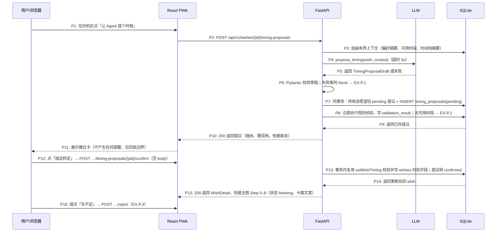

# delta — core-S03-set-timing.md（preferences-availability-timing）

## ADDED — 时机提议分支（S08 增补：TimingProposal 确认链路）

> 本节为 preferences-availability-timing 提案对 S03 的唯一增量。既有 22 步主路径与 9 个 EX 完全不变；提议分支只在 Step 1（用户尚未点「就这样」）之前插入一条可选路径，确认动作等价于用户手动完成 Step 3–4。

### 参与方（分支图）

| 别名 | 全名 | 说明 |
|------|------|------|
| U | 用户 / 浏览器 | — |
| W | React PWA | P3 时机区与 `#timing-advice` 确认半屏 |
| API | FastAPI | 四层链路的第 1–3 层都在这里 |
| LLM | LLM（OpenAI 兼容） | 只产出建议草稿，可失败、可超时 |
| DB | SQLite | `timing_proposals`、`wishes`、`user_preferences`、`availability_windows` |

### 时机提议分支时序图

### 分支步骤说明

1. **用户**在 P3 时机区点「让 Agent 提个时候」。入口仅 `seeded`（未约定时机）状态显示。
2. **W** 调用 `POST /wishes/{id}/timing-proposals`，无 request body。
3. **API** 组装**有界上下文**：偏好摘要 1 份 + 命中的偏好/可用时段明细 + 该愿望时间线摘要；**不注入完整对话历史**（隐私边界，架构 5.3 增补）。
4. **API** 调用 `propose_timing`，超时 5 秒与全局 LLM 约定一致。
5. **LLM** 返回结构化草稿（timing_type / timing_value / reason / confidence / evidence），失败或超时返回空。
6. **API** 用 Pydantic 二次校验草稿；校验失败或 `None` 等同降级 → 见 EX-P.1。草稿的 `timing_type` 只允许 4 种时间类（season / month_day / after_months / free_weekend）。
7. **API** 在一个事务里把该愿望既有的 pending 提议置 `expired`（部分唯一索引 `idx_timing_proposals_single_pending` 兜底），再插入新提议（status='pending'，expires_at=now+7 天）。
8. **API** 立即执行与 `setWishTiming` 完全相同的确定性校验，结果写入 `validation_result`；`free_weekend` 类建议要求用户至少有一条可用时段，否则 valid=false → 见 EX-P.2。校验失败的提议照常入库但 status='expired'，保留「为什么没成立」的审计。
9. **DB** 返回已存提议。
10. **API** 返回 `200` 与提议内容；`evidence` 只含依据条目 ID，内容由服务端解密后附在响应里供展示。
11. **W** 展示建议卡：建议时机（复用 6 选项卡面文案）、一句理由、置信档（「大概猜的」/「比较确定」，不露百分比）、依据条目。此步起建议已落库但**不产生任何副作用**：不进 outbox、不改状态、不发通知。
12. **用户**点「就这样定」。**W** 调用 confirm，**body 为空**——确认接口只接受已校验的提议，不接受任何触发时间字段 → 见 EX-P.4。
13. **API** 在事务内复用 `setWishTiming` 的校验与计算写入 `wishes`（`next_trigger_at` 服务端计算），提议转 `confirmed` 并记 `decided_at`。依据条目在确认前被撤回/删除 → 见 EX-P.5。
14. **DB** 返回更新后的愿望。
15. **API** 返回 `200`；此后主图 Step 5–8 的既有表现（状态 brewing、卡面文案、Scheduler 扫描、周预算）原样生效。
16. 用户也可点「先不定」→ `POST …/reject`，提议转 `rejected`，无任何 wishes 写入 → 见 EX-P.3。

### 分支异常用例

### EX-P.1: 时机建议生成失败或超时（← 需求 S08 边界 + 架构降级约定）
- **触发条件**：P4 LLM 超时（5 秒）、返回 `None`、或 Pydantic 校验失败
- **期望响应**：`HTTP 200 {proposal: null, degraded: true}`，前端文案「它暂时没想出来，你可以先自己选一个」并保留 6 选项入口
- **副作用**：不写任何 `timing_proposals` 行；愿望状态与数据零变化；可再次点击重试（每次都是新的 P2 请求）

### EX-P.2: 规则校验不通过（技术边界，四层边界第 2 层）
- **触发条件**：P8 校验发现参数非法（如 month_day=2027-02-30）、或 free_weekend 但用户没有任何可用时段（reason_code=PROPOSAL_NO_AVAILABILITY）
- **期望响应**：提议照常入库但 `status='expired'`、`validation_result={"valid": false, "reason_code": …}`；响应 `200` 且提议标记为不可确认；前端展示「这条建议先不成立」
- **副作用**：保留审计（为什么模型建议没成立）；confirm 接口对 invalid 提议返回 `409 PROPOSAL_NOT_CONFIRMABLE`

### EX-P.3: 用户拒绝建议
- **触发条件**：P16 用户点「先不定」
- **期望响应**：`HTTP 200`，提议转 `rejected`、记 `decided_at`；**不写 wishes 任何字段**；不自动生成新建议；用户手动选择 6 选项的路径完全不受影响
- **副作用**：同一依据组合不被反复推销——P6 入口仍在但需用户主动触发

### EX-P.4: 确认请求携带触发时间字段（技术异常，安全边界）
- **触发条件**：P12 confirm 请求 body 携带 `next_trigger_at` / `proposed_trigger_at` 等任何时间字段
- **期望响应**：`HTTP 422 PROPOSAL_CONFIRM_BODY_FORBIDDEN`（confirm 的 body 必须为空）
- **副作用**：与 S03 主路径「前端传入 next_trigger_at 被忽略」同一原则的加强版——确认通道根本不定义时间字段，而非忽略

### EX-P.5: 建议依据被撤回或删除
- **触发条件**：P11–P12 之间，用户在 P6 撤回/删除了该建议引用的偏好或可用时段条目
- **期望响应**：提议立即置 `expired`；confirm 返回 `409 PROPOSAL_EXPIRED`；前端把卡片置灰为「这条建议过期了，可以再要一条」
- **副作用**：`evidence` 只存条目 ID 引用，删除后服务端校验引用完整性即可发现失效，不需要复制内容比对
