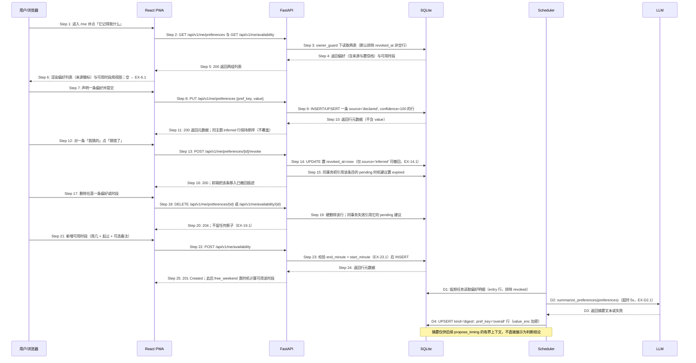

## ADDED — S08: 管理偏好与可用时段

# S08: 管理偏好与可用时段 — 时序图

> 模块：core｜功能分组：F02 时机与陪伴推进｜优先级：P1
> 上游：`../../1-product-requirements/core-01-requirements.md` S08、`../../2-product-design/1-feature-specs/core-05-preferences-availability-design.md`
> 来源提案：preferences-availability-timing。本场景同时关闭编排索引待确认项 OQ-3 的「偏好写入」部分（OQ-3 要求为 P6 建场景补端点）；users.push_enabled / email_enabled 的写端点属提醒通道开关，仍由 P6 后续场景另行补充。

## 参与方

| 别名 | 全名 | 说明 |
|------|------|------|
| U | 用户 / 浏览器 | — |
| W | React PWA | `/me#remembered`「它记得我什么」区 |
| API | FastAPI | `/api/v1`；偏好、可用时段与摘要的全部读写 |
| DB | SQLite | `user_preferences`、`availability_windows`、`timing_proposals` |
| SCH | Scheduler 进程 | 低频任务：提议过期扫描、偏好摘要生成 |
| LLM | LLM（OpenAI 兼容） | 仅摘要生成（`summarize_preferences`），可失败 |

## S08 管理偏好与可用时段

## 步骤说明

1. **用户**从 `/garden` 右上角进入 `/me`，点「它记得我什么」锚点区。
2. **W** 并发请求 `GET /me/preferences` 与 `GET /me/availability`，无分步加载。
3. **API** 经仓储层注入 `owner_id` 读取；默认排除 `revoked_at` 非空行（已撤回痕迹由 `include_revoked=true` 显式取得）。
4. **DB** 返回两组行。偏好行含 `kind`（entry/digest）、`source`（declared/inferred）、`confidence`；摘要行（digest）随列表一并返回，前端折叠为「它的理解」一项。
5. **API** 返回 `200`；响应不含任何统计字段。
6. **W** 渲染列表与周视图。来源徽标：`declared`→「你说过的」，`inferred`→「我猜的」+ 置信档文案（≥80「比较确定」，否则「大概猜的」，不露数字）。两组均为空 → 见 EX-6.1。
7. **用户**在声明输入框写下偏好（≤200 字）并选择主题标签。
8. **W** 调用 `PUT /me/preferences`。服务端忽略请求中的任何 `source` / `confidence` 字段——用户写入一律 `declared` / `100`。
9. **API** 以 `(owner_id, kind='entry', pref_key)` UPSERT 一行：存在同 key 的 declared 行则更新 `value_enc`；同 key 的 inferred 行**不动**（并列展示，由用户自行处置）。历史值不建修订表——偏好不是愿望原话，声明以最新为准。
10. **DB** 返回行元数据（id、pref_key、source、created_at、updated_at）。
11. **API** 返回 `200`，**响应不回显 value 明文**（敏感值不回显原则；用户回看走 Step 2 的 GET）。
12. **用户**对一条 `inferred` 行点「猜错了」。
13. **W** 调用 `POST /me/preferences/{id}/revoke`。
14. **API** 校验该行属于当前用户且 `source='inferred'` 且未撤回，置 `revoked_at=now()`。重复撤回 → 见 EX-14.1。
15. **API** 同事务扫描 `timing_proposals` 中 `evidence` 引用了该条目的 `pending` 提议并置 `expired`——撤回立即退出一切判断。
16. **API** 返回 `200`；前端把该条移入「你看过的猜测」折叠区。
17. **用户**删除任意一条偏好或可用时段。
18. **W** 调用对应 `DELETE`。
19. **API** 硬删除该行（无软删除），同事务失效引用它的 pending 建议。响应 `204`；不出现「已删除 N 条」计数 → 见 EX-19.1。
20. 删除完成。导出、后续摘要与建议的上下文不再含它。
21. **用户**以结构化选择新增可用时段：周几（0–6，0=周一）、起止时间（分钟步进）、可选备注（≤50 字）。
22. **W** 调用 `POST /me/availability`。
23. **API** 校验 `end_minute > start_minute`（跨午夜段由前端拆为两行提交）；非法 → 见 EX-23.1。`note_enc` 加密落库。
24. **DB** 返回行元数据。
25. **API** 返回 `200`。此后 S03 的 `free_weekend` 时机计算与 `propose_timing` 的 free_weekend 建议均以本表为依据；无任何时段时 free_weekend 建议在提议层校验即不成立（S03 EX-P.2）。

### 摘要支线（D1–D4）

- **D1** Scheduler 低频任务（每日一次）读取当前用户全部 `kind='entry'` 且未撤回的偏好行。
- **D2** 调用 `summarize_preferences`，上下文**只有偏好明细与相关片段**，不含对话历史（有界上下文）。失败 → 见 EX-D2.1。
- **D3** LLM 返回摘要文本或失败。
- **D4** 以 `(owner_id, kind='digest', pref_key='overall')` UPSERT 摘要行，`value_enc` 加密，只保留最近一份。摘要与明细一样可查看、可删除；删除后下一周期自然重建，用户也可让摘要保持为空。

## 异常用例

### EX-6.1 「它记得我什么」为空
- **触发步骤**：Step 6
- **前置条件**：当前用户无任何偏好与可用时段
- **系统行为**：两组各显示空态「它还什么都不知道。你想让它记住什么？」与单一输入入口；不出现「你还没有添加」句式、补齐引导或条数统计。

### EX-14.1 重复撤回或撤回不适用条目
- **触发步骤**：Step 13–14
- **前置条件**：目标行已撤回（`revoked_at` 非空），或 `source='declared'`（用户自己的声明没有「猜错」语义，直接删除即可）
- **系统行为**：`HTTP 409 PREFERENCE_NOT_REVOCABLE`；前端对已撤回行隐藏「猜错了」动作；不产生第二条撤回痕迹。

### EX-19.1 删除的幂等与影子检查
- **触发步骤**：Step 18–20
- **前置条件**：同一 id 被重复删除，或该行属于其他用户
- **系统行为**：重复删除返回 `404 PREFERENCE_NOT_FOUND` / `AVAILABILITY_NOT_FOUND`（硬删除后资源不存在）；跨用户访问一律 `404` 不暴露存在性；导出数据与后续摘要中均无该条。

### EX-23.1 可用时段时间非法
- **触发步骤**：Step 23
- **前置条件**：`end_minute <= start_minute`、`weekday` 超出 0–6、或分钟值超出 0–1440
- **系统行为**：`HTTP 422 AVAILABILITY_INVALID`；不产生半写入行；前端在步进器旁提示「结束要晚于开始」，禁用保存按钮而非弹模态。

### EX-D2.1 摘要生成失败
- **触发步骤**：D2–D3
- **前置条件**：LLM 超时或返回 `None`
- **系统行为**：本轮跳过，**不重试队列**（区别于 wish_understanding 类任务）：既有 digest 行保持不变，无 digest 行则保持缺失；下一周期自然重试；不记 error 级告警（低频辅助任务，连续失败由 LLM 降级率指标覆盖）。
- **副作用**：无任何用户可见变化；`propose_timing` 在缺摘要时退化为直接使用偏好明细的有界子集。
