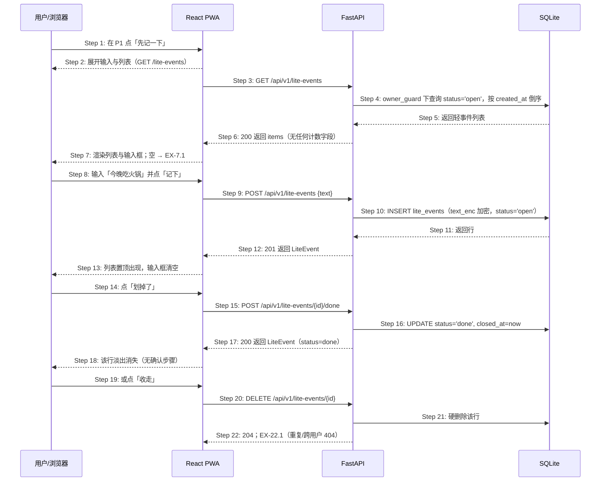

## ADDED — S09: 先记一下并随手划掉

# S09: 先记一下并随手划掉 — 时序图

> 模块：core｜功能分组：F05 轻量记录（lightweight-events 新增功能分组）｜优先级：P1
> 上游：`../../1-product-requirements/core-01-requirements.md` S09、`../../2-product-design/1-feature-specs/core-06-lite-events-design.md`

## 参与方

| 别名 | 全名 | 说明 |
|------|------|------|
| U | 用户 / 浏览器 | — |
| W | React PWA | P1「先记一下」区 |
| API | FastAPI | `/api/v1` |
| DB | SQLite | `lite_events` 表 |

**刻意不在场**：LLM（轻事件不调用 Agent）、Scheduler（轻事件不在任何扫描集合）、Push/邮件（轻事件无提醒路径）。这是本场景的核心设计：参与方清单本身就是「无提醒压力」的证明。

## S09 先记一下并随手划掉

## 步骤说明

1. **用户**在 P1 主输入下方点「先记一下」次级入口。
2. **W** 展开区域：输入框 + 现有轻事件列表；展开/收起为纯前端状态。
3. **W** 请求 `GET /lite-events`（默认只取 `status='open'`）。
4. **API** 经仓储层注入 `owner_id`，按 `created_at` 倒序。
5. **DB** 返回 open 状态的轻事件。
6. **API** 返回 `200`；响应不含任何计数字段。
7. **W** 渲染列表与输入框；为空时只显示引导句 → 见 EX-7.1。
8. **用户**输入一句话（≤200 字）。
9. **W** 调用 `POST /lite-events`。前端空内容禁用「记下」；服务端再校验（双层防御，S09 验收-异常3）。
10. **API** 写入 `lite_events`：`text_enc` 应用层 AES-256-GCM 加密，`status='open'`。
11. **DB** 返回行。
12. **API** 返回 `201` 与完整 LiteEvent（含 text——「记下」后立即可见的保存确认）。
13. **W** 置顶显示、清空输入框，可连续记录。
14. **用户**点「划掉了」。
15. **W** 调用 `POST …/done`。无确认步骤（轻事件不值得打断用户）。
16. **API** 置 `status='done'`、`closed_at=now`（CHECK 配对约束）。
17. **API** 返回 `200` 与更新后的 LiteEvent。
18. **W** 该行淡出消失；默认列表从此不含它（`include_done=true` 可追溯）。
19. **用户**也可点「收走」。
20. **W** 调用 `DELETE /lite-events/{id}`。
21. **API** 硬删除该行，无软删除标记。
22. **API** 返回 `204`；重复或跨用户 → 见 EX-22.1。

## 异常用例

### EX-7.1 轻事件列表为空
- **触发步骤**：Step 7
- **前置条件**：当前用户没有任何 open 状态的轻事件
- **系统行为**：只显示输入框与引导「想到什么小事，一句话记下它」；不出现「你还没有记录」句式、条数统计或补齐引导。

### EX-9.1 内容为空或超长
- **触发步骤**：Step 9
- **前置条件**：text 为空 / 全空白 / 超 200 字
- **系统行为**：`HTTP 422 VALIDATION_FAILED`；前端已禁用按钮（双层防御）；不产生空记录或截断写入。

### EX-22.1 收走的幂等与跨用户
- **触发步骤**：Step 20–22
- **前置条件**：同一 id 重复删除，或该行属于其他用户
- **系统行为**：重复删除返回 `404 LITE_EVENT_NOT_FOUND`（硬删除后资源不存在）；跨用户一律 404 不暴露存在性（owner_guard + 审计日志与 S05 EX-3.1 同策略）。

### EX-14.1 对已划掉的事件重复操作
- **触发步骤**：Step 15
- **前置条件**：目标行 `status='done'`
- **系统行为**：再次 done 返回 `409 LITE_EVENT_ALREADY_CLOSED`（幂等保护而非静默重放）；done 与 closed_at 由 CHECK 配对约束保证一致。
