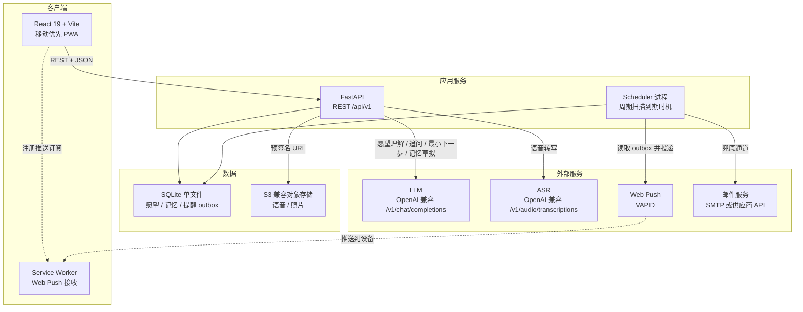

# 未发生事件管理局 系统架构概要

> 最后更新：2026-09-03
> 模块：core｜阶段：Phase 3 Step 0 架构设计与技术选型（How 的前置）
> 上游：`../../1-product-requirements/core-01-requirements.md`（S01–S08）、
> `../../2-product-design/1-feature-specs/core-00-information-architecture.md`、
> `../../2-product-design/2-page-design/design-system.json`

## 一、系统概览与架构模式

**架构模式：前后端分离 + 单体后端 + 单数据库 + 一个独立调度进程。**

判断依据：7 个核心场景、单一用户角色、无多租户、无实时协作、无高并发预期（第一版目标千级活跃用户）。唯一超出「纯 CRUD 单体」的部分是**时机到达后的主动提醒**——它必须在没有用户在线的情况下按时触发，因此需要一个与 HTTP 请求生命周期解耦的调度进程。除此之外不引入消息队列、缓存层或微服务。

产品对架构提出的三个真实约束（来自需求文档，不是通用最佳实践）：

1. **提醒不能超发**——「每用户每自然周 ≤ 3 条」是产品指标而非技术偏好，必须由服务端强制，不能交给前端或第三方推送平台。
2. **Agent 不可用不能阻塞记录**——S01/S02/S06 的异常验收条件要求先落库用户原话、后补理解，所以 LLM 调用必须是**记录成功之后**的独立步骤，不能放在写入事务的关键路径上。
3. **全部内容仅本人可见**——愿望原话、语音、照片都是高敏感个人数据，隔离必须有两道防线，不能只靠应用层的 `WHERE owner_id = ?`。

## 二、系统架构图



架构图中的 6 类参与方（PWA、FastAPI、Scheduler、SQLite、对象存储、外部服务）就是 Phase 3 Step 1 时序图的参与方，两者必须保持一致。6 份时序图的 `participant DB` 已同步改为 `SQLite`，调用序列本身不变。

## 三、技术选型

### 3.1 前端

| 维度 | 选型 | 理由 | 备选方案 |
|------|------|------|---------|
| 语言 | TypeScript 5.x | 与 API 契约共享类型（由 OpenAPI 生成），减少手写 DTO | JavaScript（放弃类型安全） |
| 框架 | React 19 + Vite 6 | 用户指定；Vite 冷启动快、纯静态产物可放任意 CDN | Next.js（用户已排除全栈方案） |
| 路由 | React Router 7 | IA 已定义 `/garden?state=…` 深链，需要成熟的 URL 状态映射 | TanStack Router |
| 数据层 | TanStack Query 5 | 愿望卡列表需乐观更新（状态流转即时反馈）+ 失效重取 | SWR、手写 fetch |
| 样式 | Tailwind CSS 4 + `@theme` 映射 `design-system.json` | Phase 2 令牌已固化，`@theme` 可把 11 个颜色令牌一次性注册为工具类，避免设计与实现漂移 | 纯 CSS Modules（原型现状） |
| PWA | `vite-plugin-pwa`（Workbox） | 需求 5.1 要求可安装 + Web Push；Service Worker 需自管推送事件 | 手写 SW |
| 测试 | Vitest + Testing Library + Playwright | 交互级验收条件（按钮 disabled、无逾期标记）需组件级断言 + 关键路径 E2E | Jest + Cypress |
| 包管理 | pnpm | 磁盘与安装速度 | npm |

### 3.2 后端

| 维度 | 选型 | 理由 | 备选方案 |
|------|------|------|---------|
| 语言 | Python 3.12 | 用户指定 FastAPI；LLM/ASR 生态在 Python 侧最完整 | Node.js（与前端同语言） |
| 框架 | FastAPI 0.115+ | 用户指定；自动产出 OpenAPI 3.1，可直接喂给 Phase 3 Step 2 的 api-designer 与前端类型生成 | Litestar、Flask |
| 校验 | Pydantic v2 | FastAPI 原生；愿望理解的结构化输出直接用 Pydantic 模型约束 | dataclasses + 手写校验 |
| ORM / 迁移 | SQLAlchemy 2.0（async, aiosqlite）+ Alembic | 状态机迁移需要可回滚的版本化 schema。**注意 SQLite 的 ALTER TABLE 能力有限，改列必须用 `op.batch_alter_table()`** | SQLModel、Tortoise |
| 数据库 | **SQLite 3.40+（单文件 + WAL）** | 用户指定。零运维、零外部服务、备份即复制文件；千级用户、写入稀疏的场景下单写者不构成瓶颈；测试无需容器即可全量跑 | PostgreSQL 17（换回可获得 RLS 与并发写，代价是运维与部署复杂度） |
| 认证 | 自管 JWT（Argon2id 密码哈希 + access/refresh，refresh 存 httpOnly Cookie） | 无第三方锁定，与「只要支持 OpenAI 格式」体现的供应商中立偏好一致；SQLite 无数据库角色，因此不再有 app/auth/scheduler 三套连接串 | Supabase Auth、Auth0（引入外部依赖与出境数据） |
| 对象存储 | S3 兼容（本地 MinIO / 生产可换 R2 或云 OSS） | 语音与照片按需替换供应商；服务端只依赖 S3 API | 直接存数据库大字段（备份与带宽成本高） |
| LLM / ASR 客户端 | `openai` Python SDK，`base_url` + `model` 由环境变量注入 | **用户指定：只要支持 OpenAI 格式**。任何兼容端点（自托管 vLLM、国内厂商兼容层、OpenAI 本身）零改码切换 | 各家原生 SDK（会把供应商写死进代码） |
| 调度 | APScheduler 3.x（独立进程）+ 文件锁 | 提醒只需「每 5 分钟扫一遍到期时机」，无需 Celery/Redis。SQLite 没有咨询锁，改用排他文件锁；单文件数据库本身就限定单机部署，因此单活约束天然成立 | Celery + Redis（超配）、系统 cron（无幂等与去重） |
| 邮件 | 抽象 `EmailSender` 接口，实现走 SMTP 或供应商 API | 邮件是 iOS Safari 下的必选兜底通道（需求 5.1），必须可换 | 直接硬编码某家 SDK |
| 测试 | pytest + pytest-asyncio + httpx.AsyncClient | 每个用例用 tmp_path 下的临时 SQLite 文件，**不依赖 Docker 或任何外部服务**，CI 与本地行为一致 | testcontainers（换回 PostgreSQL 时需要） |
| 包管理 | uv | 锁定可复现、装依赖快 | pip + requirements.txt、Poetry |

**关于 LLM 供应商中立的一处代价**：走 OpenAI 兼容层意味着只能使用兼容层暴露的能力（`chat.completions` + `response_format` 结构化输出 + 流式）。若将来要用某家的原生特性（例如 Anthropic 的 adaptive thinking、细粒度 prompt caching），需要在 `LLMProvider` 抽象下额外实现一个原生适配器——抽象层已为此预留，但第一版不做。

## 四、组件职责与代码结构

```text
frontend/                      React 19 + Vite（纯静态产物）
  src/pages/                   /、/welcome、/garden、/wish/:id、/book、/book/:id、/me
  src/components/              愿望卡、状态徽标、半屏、时间线、记忆页、建议卡（S08）
  src/theme/tokens.css         由 design-system.json 生成，禁止手改
  src/api/                     由后端 OpenAPI 生成的类型与客户端
backend/
  app/api/v1/                  路由层：仅做参数校验与调用 service
  app/services/                业务层：愿望状态机、提醒预算、记忆页组装、
                               偏好与可用时段、时机建议四层链路（S08）
  app/agent/                   LLMProvider 抽象、提示词、结构化输出模型、降级策略
  app/repositories/            数据访问，统一注入 owner_id
  app/models/                  SQLAlchemy 模型
  app/scheduler/               独立入口：扫描到期时机 → 写 outbox → 投递；
                               低频任务：提议过期扫描、偏好摘要生成（S08）
  migrations/                  Alembic
```

**Scheduler 是独立进程而非 FastAPI 后台任务**：提醒必须在无人访问站点时也能触发，`BackgroundTasks` 依附于请求生命周期，无法满足。

## 五、关键机制设计

### 5.1 LLM 供应商抽象与降级（对应 S01/S02/S06 的降级验收条件）

```text
LLMProvider（抽象）
  understand_wish(text) -> WishUnderstanding | None
  ask_one_question(understanding) -> str | None
  next_smallest_step(wish, rejected: list[str]) -> str | None
  draft_memory(wish, timeline) -> MemoryDraft | None
  propose_timing(wish, context) -> TimingProposalDraft | None        # S08 增补
  summarize_preferences(preferences) -> str | None                   # S08 增补

OpenAICompatibleProvider（唯一实现）
  base_url / api_key / model 全部来自环境变量
  超时 5 秒（与验收条件「≤5 秒」对齐）、重试 1 次、失败返回 None
```

- **写入顺序强制**：`先落库用户原话 → 再调用 Provider → 再回填结构化结果`。前两步分属不同事务，第二步失败不回滚第一步。
- **降级表现**：`None` 即触发产品侧降级文案（标题回退原话前 20 字 / 「先替你收好了，我稍后再慢慢读它」），不向前端暴露任何错误码。
- **结构化输出**：用 `response_format={"type": "json_schema"}`（OpenAI 兼容层通用）约束 `WishUnderstanding`，服务端再用 Pydantic 二次校验；校验失败等同 `None`，绝不把半结构化结果写库。`propose_timing` 的 `TimingProposalDraft`（timing_type / timing_value / reason / confidence / evidence）遵循同一模式，且**只允许提出 6 种时机类型中的 4 种时间类（season / month_day / after_months / free_weekend）**——signal 与 none 不是「可执行的时间」，不由模型提议。
- **待补理解队列**：降级产生的记录写入 `pending_understanding` 表，由 Scheduler 低频重试，对应产品文案里的「稍后再慢慢读它」。`summarize_preferences` 的降级不做重试队列：摘要保持上一次的有效值（或缺失），下一周期自然重试，不阻塞任何用户操作。

### 5.2 提醒调度与周预算（对应 S03 的两条异常验收条件）

```text
每 5 分钟：
  1. 取排他文件锁（SQLite 无咨询锁；单文件数据库本身限定单机，锁只为防同机多进程）
  2. 扫描 timing 到期且未投递的愿望，按用户设置时机的先后排序
  3. 对每个用户读取本自然周已投递计数
     计数 < 3 → 写入 reminder_outbox（状态 pending）
     计数 = 3 → 标记 deferred_to_next_week（前端显示「本周先不打扰你」）
  4. 投递 outbox：Web Push 优先；订阅缺失或投递失败则改走邮件
  5. 同一 (wish_id, timing_occurrence) 唯一索引保证不重复投递
```

- 周预算与去重都在服务端，前端与推送平台都不参与决策。
- 「正在发生满 60 天无动作」的关心也走同一条 outbox，占用同一份周预算。
- 用户点「还不是现在」只写新的 timing，不写任何顺延次数计数字段——数据库里不存在该列，从而在结构上保证 UI 无法显示它。

### 5.3 隐私与数据隔离（对应需求 5.1）

| 层 | 措施 |
|----|------|
| 传输 | 全站 HTTPS；语音与照片走服务端签发的短时效预签名 URL，不暴露长期凭证 |
| 应用层（第一道） | 仓储层统一注入 `owner_id`，禁止在路由层手写 `WHERE`；代码审查检查项 |
| 应用层（第二道） | 会话级 `owner_guard`：对 owner 表的 SELECT / UPDATE / DELETE 若未带 `owner_id` 或主键谓词，直接抛 `OwnerGuardError`。跨 owner 查询（按邮箱查用户）必须用显式的 `owner_guard_bypass()` 声明 |
| 静态加密 | 对象存储启用服务端加密；所有「用户自己说的话」以应用层 AES-256-GCM 加密为 `*_enc BLOB` |
| 删除 | 「彻底删除」为硬删除，级联清除媒体对象与对话记录，无软删除标记可供恢复 |

**换到 SQLite 后这一节的实质变化，必须诚实记录：**

原方案的第二道防线是 PostgreSQL 的行级安全策略——漏写 `owner_id` 条件时**数据库**返回空集。SQLite 没有 RLS，现在的第二道防线是**进程内断言**：它能在开发与测试期抓住「忘了加 owner_id」，但绕过 ORM 直接开一个 `sqlite3` 连接就能绕过它。**隔离强度实质性下降了一档**，这是选择 SQLite 的直接代价。缓解措施有三条：`owner_guard` 默认开启且无全局关闭开关（只有显式的单次 bypass）、`UT-S05-11~13` 专门断言守卫生效、以及越权访问统一返回 404 而非 403（S05 EX-3.1）不变。

**加密方式的变化反而是改善**：pgcrypto 在数据库进程内加密，应用发送的是明文参数，因此必须强制关闭 PostgreSQL 语句日志（原部署方案 3.4）。改为应用层 AES-256-GCM 后，明文根本不进入 SQL，那条强制要求随之取消——攻击面变小了。代价不变：`*_enc` 列仍不可用于 `WHERE` / `ORDER BY` / `JOIN`。

`ENCRYPTION_KEY` 取代原 `PGCRYPTO_KEY`，仍是整套部署里唯一不可重建的东西：丢失即所有用户内容永久不可读，必须与数据库文件**分开存放**并离线冷备。

### 5.3 增补：偏好与可用时段的隐私分层（S08）

| 数据 | 分层 | 措施 |
|------|------|------|
| 用户主动声明的偏好（`declared`） | 用户内容 | `value_enc` 应用层 AES-256-GCM；可查看、可硬删除 |
| 模型推断的偏好（`inferred`） | 模型产出 | 同样加密；额外要求**可撤回**——撤回置 `revoked_at` 保留审计痕迹并立即退出一切判断；也可硬删除 |
| 偏好摘要（`kind='digest'` 行） | 模型产出 | 定期由 Scheduler 低频生成，同表存储、同样加密；可查看、可删除；生成时**只注入偏好明细与相关片段，不注入完整对话历史**（上下文有界） |
| 可用时段（`availability_windows`） | 用户内容 | 结构化字段（周几 + 分钟区间）明文存储——它们只表达「一周里什么时候可能有空」，不含内容文本；可选备注 `note_enc` 加密 |
| 时机建议（`timing_proposals`） | 模型产出 | 理由 `reason_enc` 加密；`evidence` 只存依据条目的 **ID 引用**，不复制内容——条目删除后引用自然失效，避免「删了还在用」 |

**边界重申（对应需求 5.1 的 S08 增补约束）**：模型产出的全部三类内容（推断偏好、摘要、时机建议）都只是「待用户接受的候选」，确认动作是唯一能把它们变成既有链路状态（时机字段）的通道；Scheduler 只扫描 `wishes` 的合法时机，永远不读 `timing_proposals`。

### 5.4 TimingProposal 四层边界：模型提议、规则校验、用户确认、调度执行（S08）

```text
第 1 层 模型提议（LLM，可失败）
  输入：愿望本身 + 有界的上下文（偏好摘要、可用时段、该愿望的时间线摘要）
  输出：TimingProposalDraft（timing_type ∈ 4 种时间类 / timing_value / reason / confidence / evidence）
  落库：status='pending'，服务端立即做第 2 层校验并把结果写进 validation_result

第 2 层 规则校验（服务端，确定性）
  复用 setWishTiming 的全部校验：类型枚举、参数格式、日期存在性、时区换算
  free_weekend 额外校验：用户是否存在至少一条可用时段；无 → valid=false（PROPOSAL_NO_AVAILABILITY）
  校验失败的提议照常入库（status='expired'），validation_result 记录 reason_code——保留「为什么这条建议没成立」的审计能力
  next_trigger_at 一律由服务端计算；proposed_trigger_at 只是模型给出的参考展示值，永不写入 wishes

第 3 层 用户确认（唯一生效通道）
  confirm：服务端在事务内复用 setWishTiming 写入 wishes（等价于用户手动选择），提议转 confirmed
  reject：提议转 rejected，记录 decided_at；不写任何 wishes 字段
  过期：创建时写 expires_at（默认 7 天），Scheduler 低频扫描把超时 pending 置 expired
  结构性约束：同一愿望至多 1 条 pending（部分唯一索引）；依据条目被撤回/删除时 pending 提议立即置 expired

第 4 层 调度执行（Scheduler，与现状完全一致）
  只扫描 wishes 的 timing 字段 → reminder_outbox → 周预算与去重
  不读取 timing_proposals；提醒文案仍为模板拼接，不调用 LLM
```

为什么坚持四层而不是让模型直接算时间：需求验收条件「模型提议未经确认不会变成任何提醒」（S08）与既有设计「`next_trigger_at` 必须由服务端计算，不能由前端传入」（S03 步骤说明）是同一条原则的两个入口——模型和前端都只是「提意见的人」，时间计算与执行永远在服务端确定性代码里。

## 六、非功能性约束

| 类别 | 约束 | 来源 |
|------|------|------|
| 性能 | 愿望理解端到端 ≤ 5 秒（P95），其中 LLM 超时硬上限 5 秒后降级 | S01/S02 验收条件 |
| 性能 | 普通读写 API P95 ≤ 300ms；`/garden` 首屏（含 12 张卡）≤ 1.5 秒（4G） | 移动优先，初期宽松 |
| 性能 | 语音上传 ≤ 60 秒音频，转写 P95 ≤ 15 秒；转写期间不阻塞卡片生成 | S02 主路径 |
| 安全 | Argon2id 密码哈希；access token 15 分钟、refresh 30 天且 httpOnly + SameSite=Lax；CORS 白名单仅前端域名 | 通用基线 |
| 安全 | 上传文件校验 MIME 与大小（音频 ≤ 10MB，图片 ≤ 8MB/张，≤ 9 张/愿望） | IA 5.4 |
| 安全 | 提交类接口限流（每用户每分钟 30 次），语音与 LLM 接口单独限流（每分钟 10 次） | 控制外部服务成本 |
| 可扩展性 | 目标千级活跃用户；单实例 FastAPI + 单 SQLite 文件足够。**SQLite 是单写者**：写入串行化，本产品写入稀疏（每用户每周 0–3 次）故不构成瓶颈；一旦写入量级上升需换回 PostgreSQL | 需求 5.2 团队规模 |
| 可扩展性 | 数据增长估算：每用户每年约 30 条愿望 + 100MB 媒体，1000 用户约 100GB 对象存储 | 估算，需实测校正 |
| 可观测性 | 结构化 JSON 日志（含 request_id / user_id）；LLM 与 ASR 每次调用记录耗时、token 数、是否降级 | 降级率是产品健康指标 |
| 可观测性 | 关键告警：LLM 降级率 > 10%、提醒投递失败率 > 5%、周预算顺延量异常上涨 | 直接对应产品指标 |
| 可观测性 | 隐私红线：日志禁止记录愿望原话、转写文本、媒体内容；只记 ID 与长度。加密改到应用层后，数据库侧不再有明文泄露路径 | 需求 5.1 |
| 开发体验 | `docker compose up` 只需起 MinIO + LLM mock（数据库是本地文件）；测试完全不依赖容器 | 保证 ST 可本地全量跑 |
| 开发体验 | CI：lint（ruff / eslint）→ 类型检查（mypy / tsc）→ UT/ST → 生成 OpenAPI 并校验与前端类型一致 | 契约漂移是分离架构的主要风险 |

## 七、外部依赖与测试策略

| 依赖 | 供应商形态 | 用于场景 | 测试策略 | 说明 |
|------|-----------|---------|---------|------|
| LLM | 任意 OpenAI 兼容 `/v1/chat/completions` | S01, S02, S04, S06, S03（时机建议，S08）, S08（偏好摘要） | `mock-service` | 本地起 OpenAI 兼容 mock，返回固定结构化 JSON；另提供「强制失败」开关以覆盖全部降级验收条件。时机建议的 mock 需支持返回 `propose_timing` 固定草稿与「不可用」两种模式 |
| ASR | 任意 OpenAI 兼容 `/v1/audio/transcriptions` | S02 | `mock-service` | 同上；失败模式用于验证「保留原始音频 + 可重试转写」 |
| Web Push | 浏览器推送服务（VAPID） | S03, S04 | `env-disable` + `test-api` | 测试环境关闭真实投递，只写 `reminder_outbox`；由 `GET /api/test/outbox?user_id=` 读取以断言周预算与去重 |
| 邮件 | SMTP 或供应商 API | S03（iOS 兜底） | `test-api` | `GET /api/test/latest-email?to={email}` 返回最近一封，用于验证兜底通道与文案 |
| 对象存储 | S3 兼容 | S02, S06 | 本地 MinIO 真实调用 | 不 mock：预签名 URL 的正确性本身就是需要验证的行为 |
| 时间 | 系统时钟 | S03, S04, S06, S08（建议过期扫描） | `fixed-value` | 时机到达、60 天停滞、发生日期早于种下日期、建议 7 天过期等断言必须可注入时间，服务层统一走 `Clock` 抽象 |

**测试后门的安全约束**：`/api/test/*` 仅在 `APP_ENV=test` 时注册路由，生产构建下不存在该模块。

## 八、部署约束与交接（→ Phase 3 Step 3 deployment-designer）

| 交接项 | 内容 |
|--------|------|
| 技术栈 | 前端 TypeScript + React 19 + Vite（静态产物）；后端 Python 3.12 + FastAPI + SQLAlchemy async；数据库 SQLite 3.40+（单文件 + WAL）；包管理 pnpm / uv |
| 运行单元 | 3 个：静态站点、`api`（uvicorn）、`scheduler`（单活） |
| 部署目标 | 本地开发、测试环境、生产环境（预发暂不覆盖） |
| 运行依赖 | S3 兼容对象存储、OpenAI 兼容 LLM 端点、OpenAI 兼容 ASR 端点、邮件通道、VAPID 密钥对。**数据库不再是外部服务**，只需一个可持久化的卷来存放 `.db` 文件 |
| 配置与密钥 | 全部走环境变量：`DATABASE_URL`、`S3_*`、`LLM_BASE_URL` / `LLM_API_KEY` / `LLM_MODEL`、`ASR_*`、`VAPID_PUBLIC_KEY` / `VAPID_PRIVATE_KEY`、`SMTP_*`、`JWT_SECRET`、`ENCRYPTION_KEY`。不可提交：`.env`、VAPID 私钥、`JWT_SECRET`、`ENCRYPTION_KEY` |
| 数据迁移 | Alembic；部署顺序为「先迁移后切流」；需支持回滚一个版本。SQLite 改列须用 `batch_alter_table` |
| 健康检查 | `GET /api/v1/health`（含数据库连通性）；`scheduler` 以心跳表最后更新时间判活 |
| smoke 最小链路 | 注册/登录 → 种下一个愿望（LLM 降级也算通过）→ 出现在 `/garden` → 约定一个时机 → 手动触发 scheduler 一次 → `reminder_outbox` 出现 1 条 → 标记已发生并生成记忆页 |

部署方案与 smoke 步骤本文件不展开，由 `deployment-designer` 输出到 `logos/resources/prd/3-technical-plan/3-deployment/`。

## 九、场景清单（作为 Phase 3 Step 1 的输入）

| 编号 | 名称 | 优先级 | 参与方 |
|------|------|--------|--------|
| S01 | 新用户建立自己的未发生之地 | P0 | PWA、API、PG、LLM |
| S02 | 随手种下一个愿望并被理解 | P0 | PWA、API、PG、对象存储、ASR、LLM |
| S03 | 为一个愿望约定属于它的时机 | P0 | PWA、API、PG、Scheduler、Push、邮件 |
| S04 | 风来了，开始第一小步 | P0 | PWA、API、PG、LLM、Scheduler |
| S05 | 回看未发生之地并重新整理（S05.1 浏览 / S05.2 整理） | P1 | PWA、API、PG |
| S06 | 把发生过的事写成一页记忆 | P0 | PWA、API、PG、对象存储、LLM |
| S07 | 唤回一个被安静放下的愿望 | P2 | PWA、API、PG |
| S08 | 管理偏好与可用时段 | P1 | PWA、API、PG、LLM、Scheduler |

## 十、待确认事项

1. **数据库已改为 SQLite（用户决定）**：单文件 + WAL，认证仍为自管 JWT，对象存储仍为 S3 兼容。代价见 5.3——数据隔离的第二道防线从数据库强制（RLS）降级为进程内断言。若将来写入量级上升或需要强隔离，换回 PostgreSQL 只需改 3.2 表格三行 + `schema.sql` 方言 + 恢复 RLS 段，业务代码因 `session_scope(owner_id, role)` 的签名保留而基本不动。
2. **ASR 供应商**：已沿用「OpenAI 格式」原则，选任意兼容 `/v1/audio/transcriptions` 的端点。具体厂商与单价待定。
3. **样式方案**：Phase 2 原型是手写 CSS 变量，实现阶段建议改 Tailwind 4 + `@theme`。若希望原型与实现完全同构，可保留纯 CSS。
4. 团队规模与 MVP 周期仍按 1–3 人 / 8 周假设（承接需求文档 5.4）。
