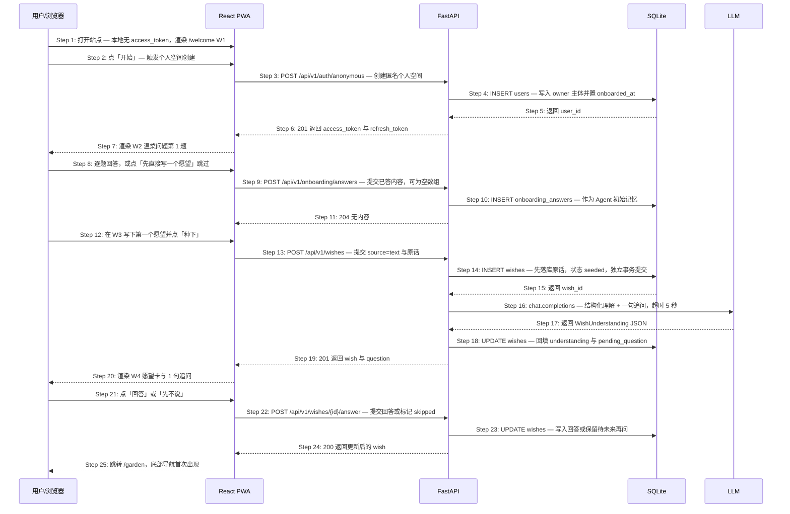

# S01: 新用户建立自己的未发生之地 — 时序图

> 模块：core｜功能分组：F01 愿望记录与理解｜优先级：P0
> 上游：`../../1-product-requirements/core-01-requirements.md` S01、`../../2-product-design/1-feature-specs/core-01-seeding-design.md`
> 架构：`../1-architecture/core-01-architecture-overview.md`

## 参与方

| 别名 | 全名 | 说明 |
|------|------|------|
| U | 用户 / 浏览器 | 移动端浏览器，首次访问 |
| W | React PWA | Vite 构建的静态前端 |
| API | FastAPI | `/api/v1` REST 服务 |
| DB | SQLite | 用户、愿望、初始记忆 |
| LLM | OpenAI 兼容端点 | 愿望理解与一句追问 |

## 时序图

## 步骤说明

1. **用户**打开站点。**W** 检查本地是否有 `access_token`；没有则渲染 `/welcome` 的 W1 欢迎屏。
2. **用户**点「开始」。
3. **W** 调用 `POST /api/v1/auth/anonymous`，不要求用户填写任何信息。如建号失败 → 见 EX-3.1。

> 这里没有注册表单是刻意的：需求指标要求「首次打开 → 种下第一个愿望 ≤ 90 秒」，任何邮箱/密码表单都会破坏它。个人空间先以匿名主体建立，邮箱绑定放到 `/me` 里作为「换设备后还能找回」的可选动作。**这是 Phase 2 未覆盖的交互缺口**，见概览文档的「待补设计」。

4. **API** 写入 `users` 记录，同时置 `onboarded_at = now()`。
5. **DB** 返回 `user_id`。
6. **API** 返回 `201` 与一对 token；**W** 存储 access token 于内存、refresh token 由服务端下发为 httpOnly Cookie。

> `onboarded_at` 在建号时就写入，而不是等首次体验走完。这样即使用户跳过问题又不输入任何内容就关掉页面（EX-12.1），下次打开也不会再被问一遍——直接对应 Phase 1 的异常验收条件。

7. **W** 渲染 W2 温柔问题第 1 题。
8. **用户**逐题回答，或点顶部「先直接写一个愿望」跳过全部剩余问题。**W** 把已填内容暂存在内存中。
9. **W** 调用 `POST /api/v1/onboarding/answers` 提交已回答的内容；跳过时提交空数组。如 DB 写入失败 → 见 EX-10.1。
10. **API** 写入 `onboarding_answers`，作为 Agent 的初始记忆语料。
11. **API** 返回 `204`。
12. **用户**在 W3 输入第一个愿望并点「种下」。若用户此时直接离开 → 见 EX-12.1。
13. **W** 调用 `POST /api/v1/wishes`，提交 `{source: "text", text}`。内容为空或超长 → 见 EX-13.1。
14. **API** 先把用户原话写入 `wishes`，状态 `seeded`，`understanding` 为 `NULL`，**并立即提交事务**。

> 这一步的事务边界是整个系统最重要的约束：LLM 调用发生在提交之后，属于另一个事务。只有这样，「Agent 不可用也不能丢掉用户说的话」才是结构上成立的，而不是依赖开发者记得写 try/except。

15. **DB** 返回 `wish_id`。
16. **API** 调用 LLM 的 `chat.completions`，用 `response_format=json_schema` 约束输出为 `WishUnderstanding`（感受倾向、隐含条件、最小下一步、一句追问），超时上限 5 秒。如超时、5xx 或 schema 校验失败 → 见 EX-16.1、EX-16.2。
17. **LLM** 返回结构化 JSON。
18. **API** 用 Pydantic 二次校验后回填 `wishes.understanding` 与 `pending_question`。
19. **API** 返回 `201`，body 含 `wish` 与 `question`。
20. **W** 渲染 W4：愿望卡（标题、种下月份、原话、状态徽标「刚种下」）+ 恰好 1 句追问。
21. **用户**点「回答」并填写，或点「先不说」。
22. **W** 调用 `POST /api/v1/wishes/{id}/answer`，body 为 `{answer}` 或 `{skipped: true}`。
23. **API** 写入回答；若为 skipped，则保留 `pending_question` 供未来再问，但本次不再追问。
24. **API** 返回 `200`。
25. **W** 跳转 `/garden`，底部导航首次出现，新卡片以发芽动效插入顶部。

## 异常用例

### EX-10.1: 初始记忆写入失败（技术异常，Phase 1 未覆盖）
- **触发条件**：Step 10 写 `onboarding_answers` 时 DB 报错或 RLS 拒绝
- **期望响应**：`HTTP 204`——刻意不向用户报错，服务端记录 error 日志与告警
- **副作用**：初始记忆丢失，个人空间与后续流程不受影响。温柔问题的答案是增强项而非必需数据，为它中断首次体验不划算

### EX-12.1: 跳过问题后未输入任何内容即离开（← Phase 1 S01 异常验收条件）
- **触发条件**：Step 12 用户在 W3 未输入内容就返回或关闭页面，未发出 `POST /api/v1/wishes`
- **期望响应**：无请求发生。下次打开时 **W** 调 `GET /api/v1/me`，读到 `onboarded_at` 非空 → 直接进入 `/garden` 空状态，不再进入 `/welcome`
- **副作用**：数据库中存在一个没有任何愿望的用户。这是合法状态，不做清理、不发唤回邮件

### EX-16.1: LLM 超时或返回 5xx（← Phase 1 S01/S02 异常验收条件）
- **触发条件**：Step 16 超过 5 秒未返回，或返回 5xx / 连接错误（已重试 1 次）
- **期望响应**：`HTTP 201`，body 为 `{wish, question: null, degraded: true}`，`wish.title` 回退为原话前 20 字
- **副作用**：Step 14 写入的记录**不回滚**；向 `pending_understanding` 插入一条待补记录供 Scheduler 低频重试；**W** 跳过 W4 直接进入 `/garden` 并显示提示条「先替你收好了，我稍后再慢慢读它」；响应体不含任何错误码或技术信息

### EX-16.2: LLM 返回非法 JSON 或 schema 校验失败（技术异常，Phase 1 未覆盖）
- **触发条件**：Step 16 返回 200 但内容不是合法 JSON，或 Pydantic 校验不通过（缺字段、类型错误）
- **期望响应**：与 EX-16.1 完全一致，对用户不可区分
- **副作用**：绝不把半结构化结果写入 `wishes.understanding`；日志记录响应长度与校验错误类型，**不记录响应内容**（隐私红线）

### EX-13.1: 提交内容为空或超长（技术异常，Phase 1 未覆盖）
- **触发条件**：Step 13 的 `text` 去空白后为空，或超过 500 字
- **期望响应**：`HTTP 422 {code: "WISH_TEXT_INVALID"}`
- **副作用**：不创建任何记录。正常路径下前端按钮为 `disabled`，此用例覆盖脚本直连与前端状态异常

### EX-3.1: 匿名建号失败（技术异常，Phase 1 未覆盖）
- **触发条件**：Step 3 时 DB 不可用或唯一约束冲突
- **期望响应**：`HTTP 503 {code: "SPACE_CREATE_FAILED"}`，**W** 以纸色提示条呈现「这里暂时打不开，你写的还在这台设备上」
- **副作用**：不创建用户；**W** 把已输入内容留在本地草稿中，用户重试成功后自动提交，不要求重新打字
