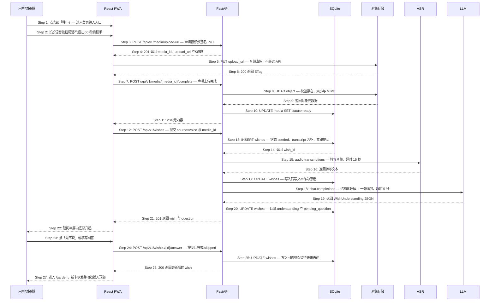

# S02: 随手种下一个愿望并被理解 — 时序图

> 模块：core｜功能分组：F01 愿望记录与理解｜优先级：P0
> 上游：`../../1-product-requirements/core-01-requirements.md` S02、`../../2-product-design/1-feature-specs/core-01-seeding-design.md`

## 参与方

| 别名 | 全名 | 说明 |
|------|------|------|
| U | 用户 / 浏览器 | 已完成首次体验的老用户 |
| W | React PWA | 首页唯一输入入口 |
| API | FastAPI | `/api/v1` |
| DB | SQLite | 愿望、媒体元数据 |
| OBJ | S3 兼容对象存储 | 原始音频与照片，前端直传 |
| ASR | OpenAI 兼容转写端点 | `/v1/audio/transcriptions` |
| LLM | OpenAI 兼容端点 | 愿望理解与一句追问 |

本图画的是**语音路径**（覆盖面最大）。纯文字路径等于跳过 Step 2–11，从 Step 12 开始且 `source=text`，其余完全一致。

## 时序图

## 步骤说明

1. **用户**从任意页面点底部居中「种下」，**W** 路由到 `/`。
2. **用户**长按语音按钮说话，**W** 本地录音并显示波形与剩余秒数，到 60 秒自动停止。若麦克风权限被拒 → 见 EX-2.1。
3. **W** 调用 `POST /api/v1/media/upload-url`，提交 `{kind: "audio", content_type, size}`。
4. **API** 返回 `media_id`、预签名 `upload_url` 与有效期（10 分钟）。

> 音频与照片一律前端直传对象存储，不经过 FastAPI。理由是单实例 uvicorn 转发 10MB 音频会长时间占用 worker，而这个产品的写入本来就稀疏——把带宽交给对象存储更划算，也顺带避免了服务端临时文件清理问题。

5. **W** 用 `PUT` 把音频直传到 `upload_url`。如失败或预签名过期 → 见 EX-5.1。
6. **OBJ** 返回 `200` 与 ETag。
7. **W** 调用 `POST /api/v1/media/{media_id}/complete` 声明上传完成。
8. **API** 对对象做 `HEAD`，校验存在性、大小 ≤ 10MB、MIME 属于允许的音频类型。校验不通过 → 见 EX-8.1。
9. **OBJ** 返回对象元数据。
10. **API** 把 `media.status` 置为 `ready`。
11. **API** 返回 `204`。
12. **W** 调用 `POST /api/v1/wishes`，提交 `{source: "voice", media_id}`。
13. **API** 先创建 `wishes` 记录（状态 `seeded`，`original_text` 为空，关联 `media_id`）**并提交事务**。
14. **DB** 返回 `wish_id`。
15. **API** 调用 ASR 转写，超时 15 秒（与 S02 非功能性约束「转写 P95 ≤ 15 秒」对齐）。失败、超时或返回空 → 见 EX-15.1、EX-15.2。
16. **ASR** 返回转写文本。
17. **API** 把转写文本写入 `wishes.original_text`（应用层加密列 `original_text_enc`），原始音频保留不删。

> 原始音频永久保留而不是转写后即删，直接来自 Phase 1 的异常验收条件「转写失败保留原始音频并可重试」。这也意味着存储估算里音频是主要成本项，已在架构文档第六节记为待实测。

18. **API** 调用 LLM 做结构化理解与一句追问，超时 5 秒。失败 → 见 EX-18.1。若 LLM 判定这是当下日程而非未来愿望 → 见 EX-18.2。
19. **LLM** 返回 `WishUnderstanding` JSON。
20. **API** 经 Pydantic 校验后回填 `understanding` 与 `pending_question`。
21. **API** 返回 `201`，body 含 `wish` 与 `question`。
22. **W** 由底部升起轻问半屏，展示卡片预览与恰好 1 句追问。
23. **用户**点「先不说」（或下滑关闭，等效），或填写回答后点提交。
24. **W** 调用 `POST /api/v1/wishes/{id}/answer`。
25. **API** 写入回答；skipped 时保留 `pending_question=true` 但当次不再追问。
26. **API** 返回 `200`。
27. **W** 进入 `/garden`，新卡片插入列表顶部。

## 异常用例

### EX-2.1: 麦克风权限被拒绝（← Phase 1 S02 异常验收条件）
- **触发条件**：Step 2 浏览器 `getUserMedia` 抛 `NotAllowedError`
- **期望响应**：纯前端处理，不发任何请求。展示一次授权引导（说明用途 + 「去设置」+「用文字写」），输入框内已有文字不清空
- **副作用**：用户选「用文字写」后本次会话不再弹出该引导

### EX-5.1: 音频直传失败或预签名过期（技术异常，Phase 1 未覆盖）
- **触发条件**：Step 5 网络中断、`PUT` 返回 4xx/5xx，或超过 10 分钟有效期
- **期望响应**：**W** 自动重试 1 次；仍失败则提示「这段话先留在这台设备上」，把音频 blob 存入 IndexedDB 待下次进入应用时重传
- **副作用**：不创建 `wishes` 记录；`media` 记录停留在 `pending`，由每日清理任务回收（见 EX-13.1）

### EX-8.1: 媒体校验不通过（技术异常，Phase 1 未覆盖）
- **触发条件**：Step 8 对象不存在、超过 10MB，或 MIME 不在白名单
- **期望响应**：`HTTP 422 {code: "MEDIA_INVALID"}`
- **副作用**：删除该对象，`media.status` 置 `rejected`，不创建 `wishes` 记录

### EX-15.1: 转写失败或超时（← Phase 1 S02 异常验收条件）
- **触发条件**：Step 15 ASR 超时、返回 5xx 或连接失败（已重试 1 次）
- **期望响应**：`HTTP 201`，`wish.title` 为「一段还没被读懂的话」，`original_text` 为空，`degraded_reason = "asr_failed"`；跳过 Step 18–20
- **副作用**：原始音频完整保留；详情页出现「再读一次这段话」（`POST /api/v1/wishes/{id}/transcription`）与「我自己写下来」（`PATCH /api/v1/wishes/{id}`）两个入口；不阻塞进入 `/garden`

### EX-15.2: 转写返回空文本（技术异常，Phase 1 未覆盖）
- **触发条件**：Step 16 返回 200 但文本去空白后为空（静音录音或纯环境噪声）
- **期望响应**：同 EX-15.1，但 `degraded_reason = "asr_empty"`，前端文案改为「好像没有听到声音，要不要自己写下来？」
- **副作用**：与 EX-15.1 一致。区分这两种原因是为了让文案准确——「没听清」和「服务坏了」对用户是两件事

### EX-18.1: LLM 理解失败（← Phase 1 S02 异常验收条件）
- **触发条件**：Step 18 超时、5xx 或 schema 校验失败
- **期望响应**：与 S01 的 EX-16.1 完全一致（`degraded: true`，标题回退原话前 20 字，写入 `pending_understanding`）
- **副作用**：Step 13 与 Step 17 的写入均不回滚

### EX-18.2: 输入内容是当下日程而非未来愿望（← Phase 1 S02 异常验收条件）
- **触发条件**：Step 19 返回的 `understanding.kind == "near_term_todo"`（如「今天下午 3 点开会」）
- **期望响应**：`HTTP 201`，`question` 为确认句「这更像是这几天要办的事，还是你想在未来发生的事？」，附 `actions: ["keep_as_future", "delete"]`
- **副作用**：记录已落库不丢弃。用户选 `keep_as_future` → `POST /api/v1/wishes/{id}/answer {action:"keep_as_future"}`；选 `delete` → `DELETE /api/v1/wishes/{id}?confirm=true` 硬删除。响应中不含「格式错误」「无效输入」一类纠正性文案

### EX-13.1: 孤儿媒体对象（技术异常，Phase 1 未覆盖）
- **触发条件**：媒体已上传但 `wishes` 创建失败或用户放弃提交，`media` 超过 24 小时未被任何愿望引用
- **期望响应**：Scheduler 每日清理任务删除对象与 `media` 记录
- **副作用**：无。此任务不占用提醒周预算（它不产生任何用户可见通知）
