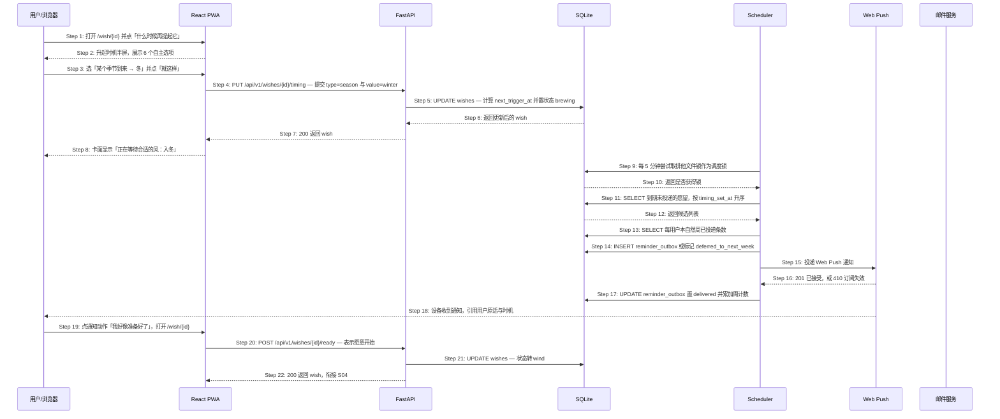
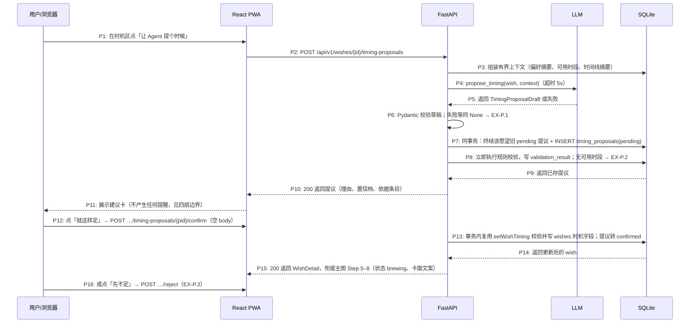

# S03: 为一个愿望约定属于它的时机 — 时序图

> 模块：core｜功能分组：F02 时机与陪伴推进｜优先级：P0
> 上游：`../../1-product-requirements/core-01-requirements.md` S03、`../../2-product-design/1-feature-specs/core-02-unhappened-place-design.md`

## 参与方

| 别名 | 全名 | 说明 |
|------|------|------|
| U | 用户 / 浏览器 | 也是通知的接收端 |
| W | React PWA | 详情页与时机半屏 |
| API | FastAPI | `/api/v1` |
| DB | SQLite | 愿望、`reminder_outbox`、周计数 |
| SCH | Scheduler 进程 | 每 5 分钟扫描到期时机 |
| PUSH | Web Push（VAPID） | 浏览器推送服务 |
| MAIL | 邮件服务 | iOS Safari 与订阅失效时的兜底通道 |

## 时序图

## 步骤说明

1. **用户**在愿望详情页点「什么时候再提起它」。
2. **W** 升起时机半屏，展示 6 个选项：某个季节到来 / 某个月份或纪念日 / 多久之后再想想 / 当我有一个空闲周末时 / 当我主动提到很累时 / 不必提醒。
3. **用户**选择一项（本图取「某个季节 → 冬」）并点「就这样」。若选「不必提醒」→ 见 EX-4.1。
4. **W** 调用 `PUT /api/v1/wishes/{id}/timing`，提交 `{type, value}`。参数非法 → 见 EX-4.2。
5. **API** 把 timing 写入 `wishes`，并**在服务端算出** `next_trigger_at`，状态转 `brewing`。

> `next_trigger_at` 必须由服务端计算，不能由前端传入——否则用户设备的时区或时钟错误会直接变成提醒时间错误。6 个选项中的「当我主动提到很累时」不是时间条件，服务端会把 `next_trigger_at` 置为 `NULL` 并打上 `trigger_kind = "signal"` 标记 → 见 EX-11.1。

6. **DB** 返回更新后的记录。
7. **API** 返回 `200`。
8. **W** 更新卡面为「正在等待合适的风：入冬」，`/garden` 中同一张卡同步刷新。
9. **Scheduler** 每 5 分钟醒来一次，先抢排他文件锁（SQLite 无咨询锁）。未抢到 → 见 EX-9.1。
10. **DB** 返回是否获得锁。
11. **Scheduler** 查询 `next_trigger_at <= now()` 且该时机尚未投递过的愿望，按用户设置时机的时间（`timing_set_at`）升序排列。

> 排序键是「用户什么时候定下这个时机」，而不是「时机什么时候到」。这样在周预算不够时被顺延的，是用户最近才随手设的那些，而不是他半年前就认真定下的那件事。

12. **DB** 返回候选列表。
13. **Scheduler** 按用户分组，读取本自然周（周一 00:00 起，用户时区）已投递条数。
14. **Scheduler** 对计数 < 3 的写入 `reminder_outbox`（状态 `pending`）；计数已达 3 的标记 `deferred_to_next_week` → 见 EX-14.1。重复扫描同一时机 → 见 EX-14.2。
15. **Scheduler** 取出 `pending` 记录，优先通过 Web Push 投递，文案模板为「你在 {种下月份} 说过{原话摘要}，{时机描述}了。」并附「我好像准备好了」「还不是现在」两个动作。

> 通知文案是纯模板拼接，不调用 LLM。原因有两个：这条文案要求逐字引用用户原话，模型改写反而是风险；而且 Scheduler 运行时无人在线，一次失败无法向用户解释。

16. **PUSH** 返回 `201` 表示已接受投递，或 `410` 表示订阅已失效 → 见 EX-16.1。两条通道都失败 → 见 EX-16.2。
17. **Scheduler** 把 `reminder_outbox` 置为 `delivered`，并累加该用户本周计数。
18. **用户**设备收到通知。
19. **用户**点通知里的「我好像准备好了」，浏览器打开 `/wish/{id}`。若点「还不是现在」→ 见 EX-20.1。
20. **W** 调用 `POST /api/v1/wishes/{id}/ready`。
21. **API** 把状态转为 `wind`（风来了），卡面出现柔光。
22. **API** 返回 `200`，流程衔接 S04。

## 异常用例

### EX-4.1: 选择「不必提醒，我自己会想起」（← Phase 1 S03 异常验收条件）
- **触发条件**：Step 3 用户选 `type = "none"`
- **期望响应**：`HTTP 200`，状态**保持** `seeded`（不转 `brewing`），`next_trigger_at = NULL`，卡面文案「你说你会自己想起它」
- **副作用**：该愿望永不进入 Scheduler 扫描集合；详情页「什么时候再提起它」仍可再次点击补设

### EX-4.2: 时机参数非法（技术异常，Phase 1 未覆盖）
- **触发条件**：Step 4 提交 `type=month_day` 但缺 `value`、日期不存在（如 2 月 30 日），或 `after_months` 不在 {1,3,6,12} 内
- **期望响应**：`HTTP 422 {code: "TIMING_INVALID"}`
- **副作用**：不修改任何字段，状态与原时机保持不变

### EX-9.1: 调度锁被其他实例占用（技术异常，Phase 1 未覆盖）
- **触发条件**：Step 9 文件锁被占用（同机多进程时另一个实例正在执行；单文件数据库本身限定单机）
- **期望响应**：本轮直接静默退出，不记 error 日志（这是预期状态而非故障）
- **副作用**：无。下一个 5 分钟窗口重试，提醒最多延迟 5 分钟送达

### EX-11.1: 「当我主动提到很累时」无法由时间触发（技术异常，Phase 1 未覆盖）
- **触发条件**：Step 5 写入 `trigger_kind = "signal"` 的愿望，`next_trigger_at` 为 `NULL`
- **期望响应**：Scheduler 的扫描条件天然排除它。改由 S04 对话链路触发：当 LLM 在用户消息中检出疲惫信号时，API 把该用户所有 `trigger_kind=signal` 的愿望置 `next_trigger_at = now()`，交回 Scheduler 正常投递
- **副作用**：这类提醒同样受周预算约束；若同时命中多条，仍按 Step 13–14 的规则顺延

### EX-14.1: 本周提醒预算已满（← Phase 1 S03 异常验收条件）
- **触发条件**：Step 13 某用户本自然周已投递 3 条
- **期望响应**：不写 `reminder_outbox`，把该 timing 标记 `deferred_to_next_week`，`GET /api/v1/wishes` 返回该卡的 `soft_deferred: true`
- **副作用**：前端显示柔光标记「本周先不打扰你」；不发任何推送与邮件；**不产生合并式提醒**（不存在「你有 N 件事待处理」这类聚合通知的代码路径）

### EX-14.2: 同一时机被重复扫描（技术异常，Phase 1 未覆盖）
- **触发条件**：Step 14 因 Scheduler 重启、锁续期失败或人工重跑，同一 `(wish_id, timing_occurrence)` 被再次处理
- **期望响应**：`reminder_outbox` 上的唯一索引拦截，`INSERT ... ON CONFLICT DO NOTHING`
- **副作用**：不重复投递、不重复计入周预算。这是「同一时机只发 1 条」的结构性保证，而非依赖代码判断

### EX-16.1: Web Push 订阅已失效（技术异常，Phase 1 未覆盖）
- **触发条件**：Step 16 返回 `404` 或 `410`
- **期望响应**：删除该 `push_subscription` 记录，立即改用邮件投递同一条内容
- **副作用**：一次时机仍只送达 1 条（两条通道不会同时发）；用户下次打开应用时前端重新注册订阅

### EX-16.2: 推送与邮件均失败（技术异常，Phase 1 未覆盖）
- **触发条件**：Step 16 之后邮件服务也返回 5xx 或超时
- **期望响应**：`reminder_outbox` 保持 `pending`，按 5 分钟 / 30 分钟 / 2 小时退避重试最多 3 次；超过 24 小时置 `failed` 并触发告警
- **副作用**：**失败不消耗周预算**——用户没收到的提醒不该占掉他这周的额度

### EX-20.1: 用户选择「还不是现在」（← Phase 1 S03 异常验收条件）
- **触发条件**：Step 19 用户点「还不是现在」
- **期望响应**：`POST /api/v1/wishes/{id}/defer`，默认 `{after_months: 3}`，状态保持 `brewing`，重算 `next_trigger_at`，响应文案「好，那就等等」
- **副作用**：数据库中**不存在**顺延次数字段，因此 UI 在结构上无法显示「已顺延 N 次」；`/garden` 中的排序位置不变，不出现任何逾期标记

## ADDED — 时机提议分支（S08 增补：TimingProposal 确认链路）

> 本节为 preferences-availability-timing 提案对 S03 的唯一增量。既有 22 步主路径与 9 个 EX 完全不变；提议分支只在 Step 1（用户尚未点「就这样」）之前插入一条可选路径，确认动作等价于用户手动完成 Step 3–4。

### 参与方（分支图）

| 别名 | 全名 | 说明 |
|------|------|------|
| U | 用户 / 浏览器 | — |
| W | React PWA | P3 时机区与 `#timing-advice` 确认半屏 |
| API | FastAPI | 四层链路的第 1–3 层都在这里 |
| LLM | LLM（OpenAI 兼容） | 只产出建议草稿，可失败、可超时 |
| DB | SQLite | `timing_proposals`、`wishes`、`user_preferences`、`availability_windows` |

### 时机提议分支时序图

### 分支步骤说明

1. **用户**在 P3 时机区点「让 Agent 提个时候」。入口仅 `seeded`（未约定时机）状态显示。
2. **W** 调用 `POST /wishes/{id}/timing-proposals`，无 request body。
3. **API** 组装**有界上下文**：偏好摘要 1 份 + 命中的偏好/可用时段明细 + 该愿望时间线摘要；**不注入完整对话历史**（隐私边界，架构 5.3 增补）。
4. **API** 调用 `propose_timing`，超时 5 秒与全局 LLM 约定一致。
5. **LLM** 返回结构化草稿（timing_type / timing_value / reason / confidence / evidence），失败或超时返回空。
6. **API** 用 Pydantic 二次校验草稿；校验失败或 `None` 等同降级 → 见 EX-P.1。草稿的 `timing_type` 只允许 4 种时间类（season / month_day / after_months / free_weekend）。
7. **API** 在一个事务里把该愿望既有的 pending 提议置 `expired`（部分唯一索引 `idx_timing_proposals_single_pending` 兜底），再插入新提议（status='pending'，expires_at=now+7 天）。
8. **API** 立即执行与 `setWishTiming` 完全相同的确定性校验，结果写入 `validation_result`；`free_weekend` 类建议要求用户至少有一条可用时段，否则 valid=false → 见 EX-P.2。校验失败的提议照常入库但 status='expired'，保留「为什么没成立」的审计。
9. **DB** 返回已存提议。
10. **API** 返回 `200` 与提议内容；`evidence` 只含依据条目 ID，内容由服务端解密后附在响应里供展示。
11. **W** 展示建议卡：建议时机（复用 6 选项卡面文案）、一句理由、置信档（「大概猜的」/「比较确定」，不露百分比）、依据条目。此步起建议已落库但**不产生任何副作用**：不进 outbox、不改状态、不发通知。
12. **用户**点「就这样定」。**W** 调用 confirm，**body 为空**——确认接口只接受已校验的提议，不接受任何触发时间字段 → 见 EX-P.4。
13. **API** 在事务内复用 `setWishTiming` 的校验与计算写入 `wishes`（`next_trigger_at` 服务端计算），提议转 `confirmed` 并记 `decided_at`。依据条目在确认前被撤回/删除 → 见 EX-P.5。
14. **DB** 返回更新后的愿望。
15. **API** 返回 `200`；此后主图 Step 5–8 的既有表现（状态 brewing、卡面文案、Scheduler 扫描、周预算）原样生效。
16. 用户也可点「先不定」→ `POST …/reject`，提议转 `rejected`，无任何 wishes 写入 → 见 EX-P.3。

### 分支异常用例

### EX-P.1: 时机建议生成失败或超时（← 需求 S08 边界 + 架构降级约定）
- **触发条件**：P4 LLM 超时（5 秒）、返回 `None`、或 Pydantic 校验失败
- **期望响应**：`HTTP 200 {proposal: null, degraded: true}`，前端文案「它暂时没想出来，你可以先自己选一个」并保留 6 选项入口
- **副作用**：不写任何 `timing_proposals` 行；愿望状态与数据零变化；可再次点击重试（每次都是新的 P2 请求）

### EX-P.2: 规则校验不通过（技术边界，四层边界第 2 层）
- **触发条件**：P8 校验发现参数非法（如 month_day=2027-02-30）、或 free_weekend 但用户没有任何可用时段（reason_code=PROPOSAL_NO_AVAILABILITY）
- **期望响应**：提议照常入库但 `status='expired'`、`validation_result={"valid": false, "reason_code": …}`；响应 `200` 且提议标记为不可确认；前端展示「这条建议先不成立」
- **副作用**：保留审计（为什么模型建议没成立）；confirm 接口对 invalid 提议返回 `409 PROPOSAL_NOT_CONFIRMABLE`

### EX-P.3: 用户拒绝建议
- **触发条件**：P16 用户点「先不定」
- **期望响应**：`HTTP 200`，提议转 `rejected`、记 `decided_at`；**不写 wishes 任何字段**；不自动生成新建议；用户手动选择 6 选项的路径完全不受影响
- **副作用**：同一依据组合不被反复推销——P6 入口仍在但需用户主动触发

### EX-P.4: 确认请求携带触发时间字段（技术异常，安全边界）
- **触发条件**：P12 confirm 请求 body 携带 `next_trigger_at` / `proposed_trigger_at` 等任何时间字段
- **期望响应**：`HTTP 422 PROPOSAL_CONFIRM_BODY_FORBIDDEN`（confirm 的 body 必须为空）
- **副作用**：与 S03 主路径「前端传入 next_trigger_at 被忽略」同一原则的加强版——确认通道根本不定义时间字段，而非忽略

### EX-P.5: 建议依据被撤回或删除
- **触发条件**：P11–P12 之间，用户在 P6 撤回/删除了该建议引用的偏好或可用时段条目
- **期望响应**：提议立即置 `expired`；confirm 返回 `409 PROPOSAL_EXPIRED`；前端把卡片置灰为「这条建议过期了，可以再要一条」
- **副作用**：`evidence` 只存条目 ID 引用，删除后服务端校验引用完整性即可发现失效，不需要复制内容比对

## ADDED — 时机提议分支增补：节假日事实（holiday-aware-timing）

> 追加到「时机提议分支（S08 增补：TimingProposal 确认链路）」之后。三处增补：P3 组装上下文加入节假日事实、free_weekend 触发日的节假日感知计算、新异常用例 EX-P.6。

### 对分支步骤的两处修订

**P3（组装有界上下文）增补**：上下文在偏好摘要、命中的偏好/可用时段明细、时间线摘要之外，追加**当前与临近的节假日事实**（最多最近 2 个节日 + 未来 1 个节日的日期区间与名称；含调休上班日的提示）。数据来自内置文件（架构 5.5），无网络请求。对应地，服务端在组装 evidence 时为引用的节假日数据追加 `{"kind": "calendar", "id": "holidays-{year}"}` 条目——id 是数据文件标识而非 UUID（`ProposalEvidence.id` 已放宽为 string）。

**第 2 层（规则校验）与主路径 Step 5 的 free_weekend 计算增补**：free_weekend 的触发日从「下一个周六/周日」改为「下一个非调休的周末日」——从明天起顺延扫描，命中第一个满足「周六或周日 且 不在当年 `workdays` 中」的日期；触发时刻沿用既有的上午约定。season / month_day / after_months 的计算不变。数据缺年份时扫描退化为「不考虑节假日」的现状语义（EX-P.6）。

> 该计算变化同时作用于两条路径：用户手动设置 free_weekend（`PUT /timing`，主路径 Step 5 的服务端计算）与采纳建议（confirm 复用同一计算）。两条路径的语义永远一致。

### 新异常用例

### EX-P.6: 节假日数据缺失或加载失败（安全降级）
- **触发条件**：当前年份没有 `holidays_{year}.json`，或文件 schema 不合法
- **期望响应**：加载器返回空集——free_weekend 计算退化为「下一个周六/周日」（现状语义）；提议上下文不含节假日事实；evidence 不出现 `calendar` 条目
- **副作用**：不报错、不告警（数据缺失是预期状态而非故障）；不阻塞记录、设置时机或生成建议。与「Agent 不可用也不阻塞记录」同一降级哲学

### EX-P.7: 建议理由引用节假日但用户未确认（边界确认）
- **触发条件**：P11 展示了引用节假日的建议，用户点「先不定」或建议过期
- **期望响应**：建议与依据一并留档（`timing_proposals` 行不变）；节假日事实本身无任何持久化副作用——它是全局公共数据，不进入用户数据
- **副作用**：无。Scheduler 与提醒链路全程不感知节假日建议（第 4 层边界不变）
