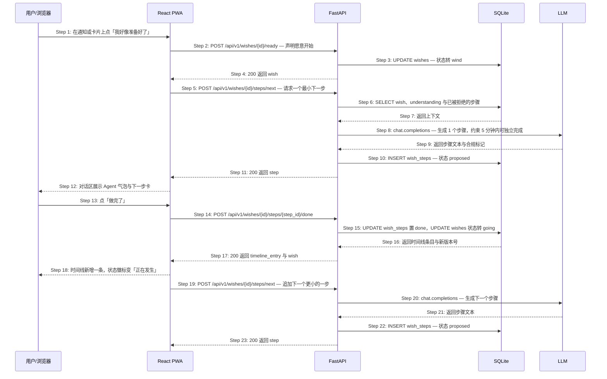

# S04: 风来了，开始第一小步 — 时序图

> 模块：core｜功能分组：F02 时机与陪伴推进｜优先级：P0
> 上游：`../../1-product-requirements/core-01-requirements.md` S04、`../../2-product-design/1-feature-specs/core-02-unhappened-place-design.md`

## 参与方

| 别名 | 全名 | 说明 |
|------|------|------|
| U | 用户 / 浏览器 | 从通知或卡片进入 |
| W | React PWA | 详情页对话区与准备过程时间线 |
| API | FastAPI | `/api/v1` |
| DB | SQLite | `wishes`、`wish_steps`、`amendments` |
| LLM | OpenAI 兼容端点 | 生成一个最小下一步 |
| SCH | Scheduler 进程 | 60 天停滞关心 |

## 时序图

## 步骤说明

1. **用户**从通知动作、`/garden` 卡片或详情页底部主动作点「我好像准备好了」。
2. **W** 调用 `POST /api/v1/wishes/{id}/ready`。
3. **API** 把状态从 `brewing` 转为 `wind`，卡面出现柔光。
4. **API** 返回 `200`。
5. **W** 立即请求一个最小下一步（不需要用户再点一次）。
6. **API** 读取愿望原话、`understanding`（感受倾向与隐含条件）以及此前被拒绝过的步骤列表。
7. **DB** 返回上下文。
8. **API** 调用 LLM，system prompt 里把约束写成硬性要求：**只给 1 个步骤**、5 分钟内可独立完成、不涉及花钱、不需要联系他人；结构化输出附 `involves_cost` / `involves_others` / `est_minutes` 三个自检字段。LLM 不可用 → 见 EX-8.1；返回不合约束 → 见 EX-8.2。

> 让模型自己回报三个自检字段，再由服务端校验，比只在 prompt 里写「不要涉及花钱」可靠得多——前者可以被代码拦下，后者只能指望模型听话。

9. **LLM** 返回步骤文本与合规标记。
10. **API** 写入 `wish_steps`，状态 `proposed`。
11. **API** 返回 `200`。
12. **W** 在对话区渲染 Agent 气泡与内嵌的下一步卡，卡内两个动作：「做完了」「还是太难了，换一个更小的」。
13. **用户**点「做完了」。若点「换一个更小的」→ 见 EX-13.1、EX-13.2。
14. **W** 调用 `POST /api/v1/wishes/{id}/steps/{step_id}/done`，请求头带当前 `version` 做乐观锁。并发冲突 → 见 EX-15.1。
15. **API** 把该步骤置 `done` 并记 `completed_at`，同时把愿望状态从 `wind` 转为 `going`。此后若长期无动作 → 见 EX-15.2。
16. **DB** 返回时间线条目与新版本号。
17. **API** 返回 `200`。
18. **W** 在准备过程时间线追加一条（含完成时间），状态徽标变为「正在发生」。
19. **W** 请求下一个步骤。
20. **API** 再次调用 LLM，把已完成与已拒绝的步骤都作为上下文传入。
21. **LLM** 返回下一个步骤。
22. **API** 写入 `wish_steps`。
23. **API** 返回 `200`。整个对话区在任何时刻**只存在 1 个 `proposed` 步骤**，不存在计划清单、剩余步骤数或完成百分比。用户在对话中改变愿望本身 → 见 EX-23.1。

> 用户主动要求时才进入「确定日期 → 整理预算 → 规划行程 → 建立提醒」这些更重的协助，走的是同一个 `POST /messages` 通道，由 LLM 的 intent 分类决定，不额外开接口。

## 异常用例

### EX-8.1: LLM 不可用（← Phase 1 S04 隐含的降级要求）
- **触发条件**：Step 8 超时（5 秒）、5xx 或连接失败
- **期望响应**：`HTTP 200 {step: null, degraded: true}`，对话区显示「我先想想，晚点再给你一个开始」
- **副作用**：状态**保持 `wind` 不回退**（用户表达的「准备好了」不应因为服务故障而作废）；写入 `pending_step` 供 Scheduler 低频重试；不向用户暴露错误码

### EX-8.2: LLM 返回的步骤违反约束（技术异常，Phase 1 未覆盖）
- **触发条件**：Step 9 返回 `involves_cost=true`、`involves_others=true` 或 `est_minutes > 5`
- **期望响应**：服务端重新请求 1 次并在 prompt 中指出违反项；仍不合规则改用内置兜底步骤库（按 `understanding.feeling` 选一条，如「想要放松」→「只是想一想：你更想听海的声音，还是想看日出？」）
- **副作用**：兜底步骤照常写入 `wish_steps`，对用户不可区分；记录降级计数用于观测 prompt 质量

### EX-13.1: 用户要求一个更小的开始（← Phase 1 S04 异常验收条件）
- **触发条件**：Step 13 用户点「还是太难了，换一个更小的」
- **期望响应**：`POST /api/v1/wishes/{id}/steps/next` 携带 `rejected_step_id`；API 把该步骤置 `rejected` 并加入排除列表，同一轮内返回更轻的替代步骤
- **副作用**：被拒绝的步骤永不再次出现（作为 prompt 的排除项 + 服务端文本相似度校验）；界面不出现「你已经拒绝 N 次」一类计数

### EX-13.2: 连续 3 次要求更小的步骤（技术异常，Phase 1 未覆盖）
- **触发条件**：同一愿望的 `rejected` 步骤累计达 3 个且无任何 `done` 步骤
- **期望响应**：不再调用 LLM，直接给出内置的最轻一档步骤（纯想象类，无任何外部动作），并附一句「不用现在做任何事也可以」
- **副作用**：为单个愿望的步骤生成设上限，避免用户反复点击造成无上限的 LLM 成本

### EX-15.1: 并发点击「做完了」（技术异常，Phase 1 未覆盖）
- **触发条件**：Step 14 两个设备或双击导致同一 `step_id` 被提交两次，`version` 不匹配
- **期望响应**：第二个请求返回 `HTTP 409 {code: "STATE_CONFLICT"}`
- **副作用**：时间线只新增 1 条；**W** 收到 409 后静默重取详情页，不向用户报错

### EX-15.2: 「正在发生」满 60 天无动作（← Phase 1 S04 异常验收条件）
- **触发条件**：Step 15 把状态转为 `going` 之后，`last_activity_at` 距今 ≥ 60 天（由 Scheduler 扫描发现）
- **期望响应**：向 `reminder_outbox` 写入 1 条关心（「那件事最近怎么样了？还想继续吗？」），**占用该用户的周预算**；详情页出现「继续推进」「先放回酝酿」「安静放下」三个并列动作
- **副作用**：每个愿望的停滞关心只发 1 次（`stale_notified_at` 字段去重）；界面不显示停滞天数与进度百分比；选「先放回酝酿」时状态回 `brewing` 且时间线保留

### EX-23.1: 用户在推进过程中改变了愿望本身（← Phase 1 S04 异常验收条件）
- **触发条件**：Step 23 之后的任意时刻，用户在对话区输入「想改成和妹妹一起去」，`POST /api/v1/wishes/{id}/messages` 后 LLM 判定 `intent = "amend"`
- **期望响应**：`HTTP 200`，更新 `title` 与 `understanding.conditions`（同行的人：妹妹），并向 `amendments` 表插入一条原始快照
- **副作用**：`seeded_at`（种下时间）与原话完整保留，详情页显示「最初你说的是：一个人去海边待两天」；已有的准备过程时间线**不清空**；状态保持 `going`
