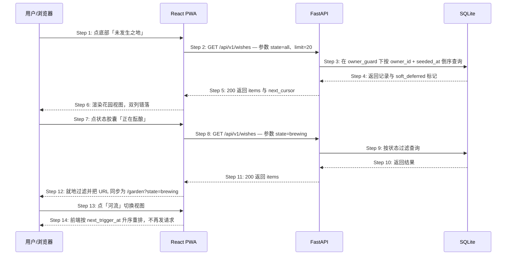
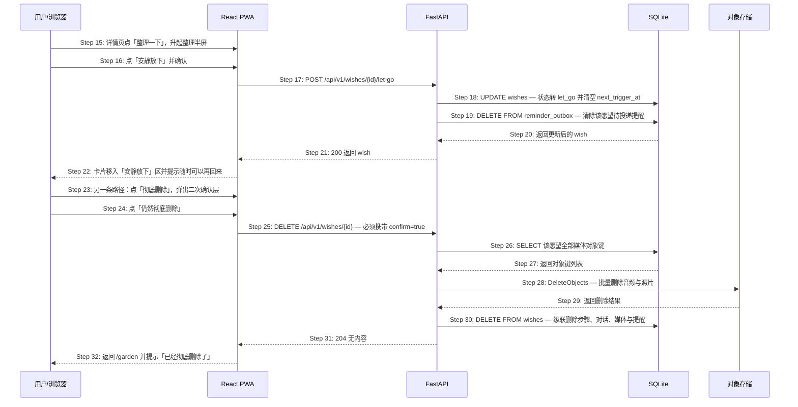

# S05: 回看未发生之地并重新整理 — 时序图

> 模块：core｜功能分组：F03 未发生之地浏览与整理｜优先级：P1
> 上游：`../../1-product-requirements/core-01-requirements.md` S05、`../../2-product-design/1-feature-specs/core-02-unhappened-place-design.md`（S05.1 / S05.2）

Phase 2 已把该场景拆为两条独立交互路径，本文件用两张时序图分别建模；编号沿用 Phase 1 主编号 S05。

## 参与方

| 别名 | 全名 | 说明 |
|------|------|------|
| U | 用户 / 浏览器 | — |
| W | React PWA | `/garden` 与详情页整理半屏 |
| API | FastAPI | `/api/v1` |
| DB | SQLite | 启用 RLS 的愿望表 |
| OBJ | S3 兼容对象存储 | 彻底删除时清除媒体 |

## S05.1 浏览未发生之地

### 步骤说明

1. **用户**点底部导航「未发生之地」。
2. **W** 调用 `GET /api/v1/wishes`，默认 `state=all`、`limit=20`、游标分页。游标非法 → 见 EX-2.1。
3. **API** 经仓储层注入 `owner_id` 后查询，语句由 `owner_guard` 校验。越权访问 → 见 EX-3.1。

> 数据隔离靠仓储层统一注入 + 会话级 `owner_guard`。SQLite 没有 RLS，因此第二道防线是进程内断言：漏写 `owner_id` 时**抛异常**而不是静默返回别人的愿望。强度不及数据库强制的 RLS，取舍见架构 5.3。

4. **DB** 返回记录，其中被周预算顺延的卡带 `soft_deferred = true`。
5. **API** 返回 `200`。
6. **W** 渲染花园视图。列表为空 → 见 EX-6.1。
7. **用户**点状态胶囊「正在酝酿」。
8. **W** 带 `state=brewing` 重新请求。该状态无卡片 → 见 EX-9.1。
9. **DB** 按状态过滤。
10. **DB** 返回结果。
11. **API** 返回 `200`。
12. **W** 就地替换列表，并把 URL 同步为 `/garden?state=brewing`，刷新后筛选保持。
13. **用户**点「河流」。
14. **W** 用已有数据按 `next_trigger_at` 升序重排，**不发新请求**。

> 视图切换是纯前端重排：两个视图用的是同一批字段，多打一次接口只会让切换出现可感知的等待。这也让「切换视图不丢失筛选」成为结构上的必然，而不是需要额外保证的行为。

## S05.2 重新整理一个愿望

### 步骤说明

S05.2 的步骤编号从 15 续接 S05.1，确保同一场景文件内 `Step N` 与 `EX-N.M` 全局无歧义。

15. **用户**在详情页点「整理一下」，**W** 升起整理半屏，5 个动作按侵入性递增排列。
16. **用户**点「安静放下」并在同一半屏内确认（不跳转、不二次弹层）。若该愿望已是「已经发生」终态 → 见 EX-17.1。
17. **W** 调用 `POST /api/v1/wishes/{id}/let-go`。
18. **API** 把状态转为 `let_go` 并清空 `next_trigger_at`。
19. **API** 在同一事务里删除该愿望所有 `pending` 状态的 `reminder_outbox` 记录。

> 放下必须同时掐断提醒队列。否则一个已经被放下的愿望仍可能在几小时后推来一条通知——这是这个产品最不能出的错。

20. **DB** 返回更新后的记录。
21. **API** 返回 `200`。
22. **W** 把卡片移入「安静放下」区，提示「它曾被认真保存过，随时可以再回来」。文案与接口响应中均不含「失败 / 放弃 / 未完成」。
23. **用户**若选择另一条路径「彻底删除」，**W** 弹出二次确认层，默认焦点在「取消」，并说明两者差别。
24. **用户**点「仍然彻底删除」。
25. **W** 调用 `DELETE /api/v1/wishes/{id}?confirm=true`。缺少 `confirm` → 见 EX-25.1。
26. **API** 先查出该愿望关联的全部媒体对象键。
27. **DB** 返回对象键列表。
28. **API** 批量删除对象存储中的音频与照片。部分失败 → 见 EX-28.1。
29. **OBJ** 返回删除结果。
30. **API** 删除 `wishes` 记录，数据库外键级联清除 `wish_steps`、`messages`、`media`、`reminder_outbox`、`amendments`。
31. **API** 返回 `204`。重复删除 → 见 EX-30.1。
32. **W** 返回 `/garden` 并提示「已经彻底删除了」，不提供撤销。

> 先删对象、后删数据库记录，顺序是刻意的：反过来一旦对象删除失败，就再也查不到该删哪些 key，直接变成永久孤儿数据。

## 异常用例

### EX-2.1: 分页游标失效（技术异常，Phase 1 未覆盖）
- **触发条件**：Step 2 的 `cursor` 无法解码，或指向已被删除的记录
- **期望响应**：`HTTP 400 {code: "CURSOR_INVALID"}`
- **副作用**：**W** 静默丢弃游标并重新请求第一页，用户只感知为一次刷新

### EX-3.1: 访问他人的愿望（技术异常，Phase 1 未覆盖）
- **触发条件**：Step 3 请求的 `wish_id` 不属于当前用户（仓储层按 owner_id 过滤后为空集）
- **期望响应**：`HTTP 404 {code: "WISH_NOT_FOUND"}`——**不是 403**
- **副作用**：403 会泄露「这个 ID 确实存在」，对一个主打私密的产品是不可接受的信息泄露。记录一条安全审计日志（含 user_id 与被请求 ID，不含内容）

### EX-6.1: 花园为空（← Phase 1 S05 异常验收条件）
- **触发条件**：Step 5 返回 `items: []` 且筛选为「全部」
- **期望响应**：`HTTP 200 {items: [], next_cursor: null}`，**W** 渲染空状态文案「这里还什么都没有。想到什么，随时来种下它。」与居中「种下」入口
- **副作用**：无。响应中不含任何统计字段（没有 total、没有 completed_count），前端在结构上拿不到可用于制造压迫感的数字

### EX-9.1: 某状态下无卡片（← Phase 1 S05 异常验收条件）
- **触发条件**：Step 8 指定状态下无记录
- **期望响应**：`HTTP 200 {items: []}`，**W** 展示该状态专属空文案（如「还没有什么正在发生。不着急。」）
- **副作用**：筛选胶囊保持激活，不自动跳回「全部」

### EX-17.1: 在「已经发生」终态尝试放下（← Phase 2 S05.2 异常验收条件）
- **触发条件**：Step 17 目标愿望状态为 `happened`
- **期望响应**：`HTTP 409 {code: "STATE_TRANSITION_NOT_ALLOWED"}`
- **副作用**：不修改任何数据。正常路径下整理半屏在终态只渲染「补充这页记忆」与「彻底删除」两项，此用例覆盖脚本直连与前端状态过期

### EX-25.1: 彻底删除缺少确认参数（技术异常，Phase 1 未覆盖）
- **触发条件**：Step 25 未携带 `confirm=true`
- **期望响应**：`HTTP 400 {code: "CONFIRMATION_REQUIRED"}`
- **副作用**：不删除任何数据。把确认做成服务端强制的必填参数，而不只是前端弹层——避免任何调用方绕过二次确认造成不可恢复的删除

### EX-28.1: 对象存储删除部分失败（技术异常，Phase 1 未覆盖）
- **触发条件**：Step 28 返回部分 key 删除失败，或对象存储超时
- **期望响应**：**继续执行 Step 30 删除数据库记录**，同时把未删成功的 key 写入 `orphan_objects` 表，由每日清理任务重试
- **副作用**：用户的删除意图立即生效；存储侧的残留在后台收敛。反之若因存储故障中止整个删除，用户会看到「删不掉」——对一个隐私产品来说这是更糟的结果

### EX-30.1: 重复删除同一愿望（技术异常，Phase 1 未覆盖）
- **触发条件**：Step 30 记录已不存在（双击或重试）
- **期望响应**：`HTTP 204`——幂等，已不存在视为删除成功
- **副作用**：无
