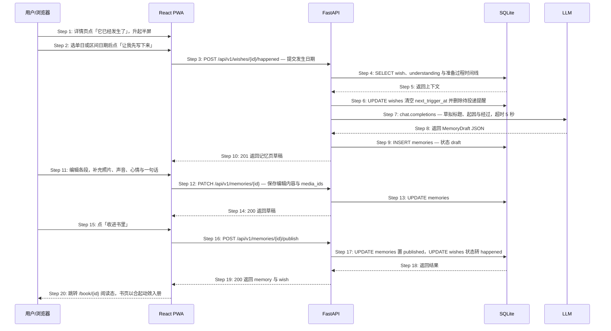

# S06: 把发生过的事写成一页记忆 — 时序图

> 模块：core｜功能分组：F04 已发生之书｜优先级：P0
> 上游：`../../1-product-requirements/core-01-requirements.md` S06、`../../2-product-design/1-feature-specs/core-03-book-of-happened-design.md`

## 参与方

| 别名 | 全名 | 说明 |
|------|------|------|
| U | 用户 / 浏览器 | — |
| W | React PWA | 「它已经发生了」半屏、草稿页、阅读态 |
| API | FastAPI | `/api/v1` |
| DB | SQLite | `wishes`、`memories`、`reminder_outbox` |
| OBJ | S3 兼容对象存储 | 记忆页照片与录音（走 S02 的直传流程） |
| LLM | OpenAI 兼容端点 | 草拟标题、起因与经过 |

## 时序图

## 步骤说明

1. **用户**在详情页点「它已经发生了」，**W** 升起半屏。
2. **用户**选「某一天」或「一段时间」并填写日期，点「让我先写下来」。日期早于种下时间 → 见 EX-3.1；日期在未来 → 见 EX-3.2；区间倒置 → 见 EX-3.3。
3. **W** 调用 `POST /api/v1/wishes/{id}/happened`，提交 `{happened_from, happened_to?, acknowledged_before_seeded?}`。愿望处于 `seeded` 且无任何准备过程 → 见 EX-4.1。
4. **API** 读取愿望原话、`understanding` 与准备过程时间线作为草拟素材。
5. **DB** 返回上下文。
6. **API** 清空 `next_trigger_at` 并删除该愿望所有 `pending` 提醒。

> 提醒在这一步就停，而不是等用户写完「收进书里」。用户已经声明这件事发生了，这是事实陈述；让他在写记忆的过程中还收到「冬天到了，你说过想学滑雪」会很荒谬。但**愿望状态**要到 Step 17 才转 `happened`——那是 Phase 2 定义的 UI 行为，两件事解耦。

7. **API** 调用 LLM 草拟标题、起因（引用原始期待）与经过（依据时间线），超时 5 秒。失败 → 见 EX-7.1。
8. **LLM** 返回 `MemoryDraft` JSON。
9. **API** 写入 `memories`，状态 `draft`，并把发生日期与 `note_before_seeded` 标记一并落库。
10. **API** 返回 `201` 与草稿。
11. **用户**编辑任意段落，补充照片（走 S02 的媒体直传流程）、声音、心情与一句话。照片超过 9 张 → 见 EX-12.1。
12. **W** 调用 `PATCH /api/v1/memories/{id}` 保存，支持自动保存与手动保存。
13. **API** 更新 `memories`；所有字段均可为空。
14. **API** 返回 `200`。
15. **用户**点「收进书里」。
16. **W** 调用 `POST /api/v1/memories/{id}/publish`。重复提交 → 见 EX-17.1；愿望已被彻底删除 → 见 EX-18.1。
17. **API** 在一个事务里把 `memories.status` 置 `published`，并把 `wishes.state` 转为 `happened`（终态）。
18. **DB** 返回结果。
19. **API** 返回 `200`。
20. **W** 跳转 `/book/{id}` 阅读态；`/book` 顶部计数 +1。

> 「你已经活过的 N 页」是这个产品里唯一允许出现的计数。它统计的是已经发生的事，不是待完成的事——数的方向决定了它是回看还是考核。

## 异常用例

### EX-3.1: 发生日期早于种下日期（← Phase 1 S06 异常验收条件）
- **触发条件**：Step 3 的 `happened_from` 早于 `wishes.seeded_at`
- **期望响应**：**服务端不拦截**。若请求未携带 `acknowledged_before_seeded=true`，响应 `201` 中带 `warning: {code: "HAPPENED_BEFORE_SEEDED"}`；**W** 用询问式确认「它比你写下它的时候更早发生了吗？」+「是的，就这样」/「我改一下日期」
- **副作用**：用户确认后重新提交并携带 `acknowledged_before_seeded=true`，`memories.note_before_seeded = true`，阅读态在日期下方注明「你是在它发生之后才写下它的」；界面不出现表单校验红字

### EX-3.2: 发生日期在未来（技术异常，Phase 1 未覆盖）
- **触发条件**：Step 3 的 `happened_from` 晚于今天
- **期望响应**：`HTTP 422 {code: "HAPPENED_DATE_IN_FUTURE"}`
- **副作用**：不创建记忆页。这是少数应当硬拦的校验——「已经发生」与未来日期在语义上直接矛盾，与 EX-3.1 的「宽容处理」不是同一类问题

### EX-3.3: 日期区间倒置（技术异常，Phase 1 未覆盖）
- **触发条件**：Step 3 的 `happened_to` 早于 `happened_from`
- **期望响应**：`HTTP 422 {code: "HAPPENED_RANGE_INVALID"}`
- **副作用**：不创建记忆页；**W** 把两个日期互换后重试（前端可自愈，不打扰用户）

### EX-4.1: 未经历约定路径直接标记已发生（← Phase 1 S06 异常验收条件）
- **触发条件**：Step 3 目标愿望状态为 `seeded`，无时机约定、无准备过程记录
- **期望响应**：`HTTP 201`——允许该操作。半屏仅追问发生日期与「如果只留一句话」；草稿页「经过」区因无时间线数据而为可选空区块，占位文案「这里可以写写它是怎么发生的」
- **副作用**：不强制补齐中间状态，不出现「请先完成前序步骤」类拦截。事情本来就可能在这个产品之外自然发生

### EX-7.1: LLM 草拟失败（← Phase 2 S06 异常验收条件）
- **触发条件**：Step 7 超时、5xx 或 schema 校验失败
- **期望响应**：`HTTP 201 {memory, degraded: true}`，标题回退为愿望原标题，起因回退为直接引用用户原话，经过为空并显示占位；**W** 顶部提示条「这一页先由你自己写，我稍后再帮你补」
- **副作用**：Step 6 与 Step 9 的写入均不回滚；写入 `pending_understanding` 供 Scheduler 低频补草拟，用户已手动编辑过的段落**不被覆盖**

### EX-12.1: 照片数量超限（技术异常，Phase 1 未覆盖）
- **触发条件**：Step 12 的 `media_ids` 超过 9 个，或引用了不属于当前用户的 `media_id`
- **期望响应**：`HTTP 422 {code: "MEDIA_LIMIT_EXCEEDED"}` 或 `404 {code: "MEDIA_NOT_FOUND"}`
- **副作用**：不保存本次编辑；已上传的多余对象由孤儿清理任务回收（见 S02 EX-13.1）

### EX-17.1: 重复点击「收进书里」（技术异常，Phase 1 未覆盖）
- **触发条件**：Step 16 记忆页已是 `published`
- **期望响应**：`HTTP 200` 幂等返回当前 `memory` 与 `wish`，不重复改状态、不重复计数
- **副作用**：`/book` 的页数不会因重复提交而虚增

### EX-18.1: 发布时愿望已在另一端被彻底删除（技术异常，Phase 1 未覆盖）
- **触发条件**：Step 17 更新 `wishes` 时记录已不存在
- **期望响应**：`HTTP 404 {code: "WISH_NOT_FOUND"}`，事务回滚
- **副作用**：草稿一并失效（`memories` 已随愿望级联删除）；**W** 提示「这件事已经被删掉了」并返回 `/garden`
