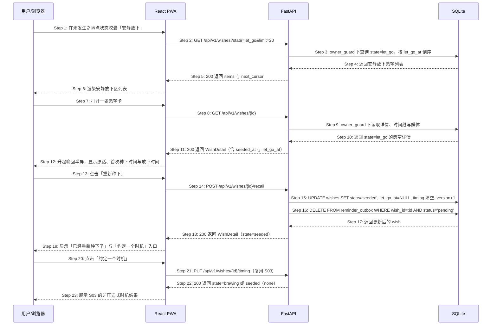

# S07: 唤回一个被安静放下的愿望 — 时序图

> 模块：core｜功能分组：F03 未发生之地浏览与整理｜优先级：P2
> 上游：`../../1-product-requirements/core-01-requirements.md` S07、`../../2-product-design/1-feature-specs/core-02-unhappened-place-design.md`（S07）

本场景只建模「用户主动从安静放下区唤回」这一主路径。需求中的第二个触发条件「种下新愿望时命中相似已放下记录」不在本提案范围，后续需要独立场景与 Agent 能力设计。

## 参与方

| 别名 | 全名 | 说明 |
|------|------|------|
| U | 用户 / 浏览器 | — |
| W | React PWA | `/garden?state=安静放下`、`/wish/:id#recall` 与 S03 时机入口 |
| API | FastAPI | `/api/v1` |
| DB | SQLite | 启用 owner_guard 的愿望表与提醒队列表 |

## S07 唤回愿望

### 步骤说明

1. **用户**在 P2 状态筛选中选择「安静放下」。
2. **W** 调用列表接口并传 `state=let_go`。分页游标沿用 S05.1；游标非法仍按 S05 EX-2.1 处理。
3. **API** 通过仓储层注入 `owner_id`，只查询当前用户的 `let_go` 愿望。漏写 `owner_id` 由 owner_guard 抛错，越权访问统一表现为 404。
4. **DB** 按 `let_go_at DESC NULLS LAST, seeded_at DESC` 返回列表。历史数据没有 `let_go_at` 时不得阻塞展示。
5. **API** 返回 `200`，响应仍不含任何统计字段。
6. **W** 渲染列表。列表为空 → 见 EX-6.1。
7. **用户**打开一张愿望卡。
8. **W** 请求详情。愿望不存在或不属于当前用户 → 见 EX-8.1。
9. **API** 读取详情、时间线与媒体引用。
10. **DB** 返回详情。若状态已不是 `let_go` → 见 EX-10.1。
11. **API** 返回 `WishDetail`，其中 `let_go_at` 仅在 `state=let_go` 时有值。
12. **W** 升起唤回半屏，显示原话、首次种下时间与放下时间；用户关闭半屏或点「再放一会儿」不发写请求 → 见 EX-12.1。
13. **用户**点击「重新种下」。
14. **W** 调用 `POST /api/v1/wishes/{id}/recall`。该端点无 request body。
15. **API** 在一个事务里把愿望改回 `seeded`：保留 `seeded_at`、标题、原话、照片、理解结果、时间线与修订记录；清空 `let_go_at`、`timing_type`、`timing_value`、`trigger_kind`、`timing_set_at`、`next_trigger_at`、`timing_occurrence`、`soft_deferred`。
16. **API** 同事务删除该愿望所有 pending 提醒，确保唤回不会继承旧提醒。
17. **DB** 返回更新后的愿望。
18. **API** 返回 `200`。
19. **W** 展示成功提示和 S03 时机入口，不展示重新种下次数。
20. **用户**可继续点击「约定一个时机」。
21. **W** 完全复用 S03 `PUT /timing`，不新增第二套时机参数。
22. **API** 返回 S03 结果。
23. **W** 展示 S03 既有非压迫式时机结果。

## 异常用例

### EX-6.1 安静放下区为空

- **触发步骤**：Step 6
- **前置条件**：当前用户没有 `state=let_go` 的愿望
- **系统行为**：返回 `200 {items: [], next_cursor: null}`；页面展示「这里还没有被安静收好的事」；不显示 0、统计、完成率或引导用户去放下一件事。

### EX-8.1 访问不存在或他人的愿望

- **触发步骤**：Step 8
- **前置条件**：愿望已被彻底删除，或 wish_id 属于其他用户
- **系统行为**：服务端返回 `404 WISH_NOT_FOUND`；前端回到 `/garden?state=安静放下` 并显示「这张卡片已经不在这里了」；安全日志不含愿望内容。

### EX-10.1 卡片状态已变化

- **触发步骤**：Step 10 / Step 14
- **前置条件**：列表加载后，另一端已把该愿望重新种下或标记为其他状态
- **系统行为**：详情页不得展示「重新种下」动作；若写请求已发到服务端，返回 `409 STATE_TRANSITION_NOT_ALLOWED`；前端重取详情并展示最新状态。

### EX-12.1 再放一会儿

- **触发步骤**：Step 12
- **前置条件**：用户打开唤回半屏
- **系统行为**：点击「再放一会儿」、遮罩关闭或返回均不调用写接口；愿望仍为 `let_go`，`let_go_at` 与列表顺序不变。
