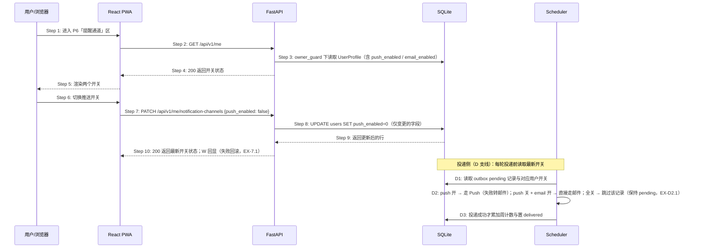

# S10: 管理提醒通道 — 时序图

> 模块：core｜功能分组：F06 通道自控（notification-channels 新增功能分组）｜优先级：P1
> 上游：`../../1-product-requirements/core-01-requirements.md` S10、`../../2-product-design/1-feature-specs/core-07-notification-channels-design.md`

## 参与方

| 别名 | 全名 | 说明 |
|------|------|------|
| U | 用户 / 浏览器 | — |
| W | React PWA | P6「提醒通道」区 |
| API | FastAPI | `/api/v1` |
| DB | SQLite | `users.push_enabled / email_enabled`（既有列） |
| SCH | Scheduler 进程 | 投递时读取最新开关（D 支线） |

## S10 管理提醒通道

## 步骤说明

1. **用户**进入 P6，锚点定位到「提醒通道」区。
2. **W** 请求 `GET /me`——UserProfile 含 `push_enabled / email_enabled`（本提案扩展）。
3. **API** 经仓储层读取当前用户（既有端点扩展，无新查询路径）。
4. **DB** 返回行。
5. **API** 返回 `200`。
6. **W** 渲染两个独立开关。
7. **用户**切换推送开关。**W** 调用 `PATCH /me/notification-channels`，body 只含变更的字段（`minProperties: 1`）。
8. **API** 只更新提交的字段；请求体为空（无变更字段）返回 `422 VALIDATION_FAILED`。
9. **DB** 返回更新后的行。
10. **API** 返回 `200` 与最新状态；**W** 回显。保存失败 → 见 EX-7.1。

### 投递侧通道选择（D1–D3）

- **D1** Scheduler 每轮投递时，对每条 pending 记录取其 owner 的**最新**开关（与投递同一事务/同一时刻读，避免竞态下的通道错配）。
- **D2** 通道选择：push 开 → 走 Push（410 失效时删除订阅并转邮件，若邮件开）；push 关 + email 开 → **直接走邮件**（不先试已关闭的推送）；**全关 → 跳过该记录**：不投递、不计失败、不改退避——记录保持 pending，下一轮再查（EX-D2.1）。
- **D3** 只有真实投递成功才置 delivered 与累加周计数；跳过不计入任何统计。

## 异常用例

### EX-7.1 开关保存失败
- **触发步骤**：Step 7–10
- **前置条件**：服务端不可用或网络中断
- **系统行为**：`HTTP 5xx`；前端把开关视觉回滚到切换前状态并提示「没能保存，再试一次」，不出现错误码；可重试。

### EX-D2.1 全关期间的顺延语义
- **触发步骤**：D2
- **前置条件**：用户两个通道均关闭，outbox 有 pending 记录
- **系统行为**：每轮扫描跳过该用户（不投递、不累加 attempts、不置 failed）；pending 记录与其周预算顺延语义保持；用户重开任一通道后，下一轮投递自然恢复（受周预算约束）。**已确认的时机不因关通道丢失**。