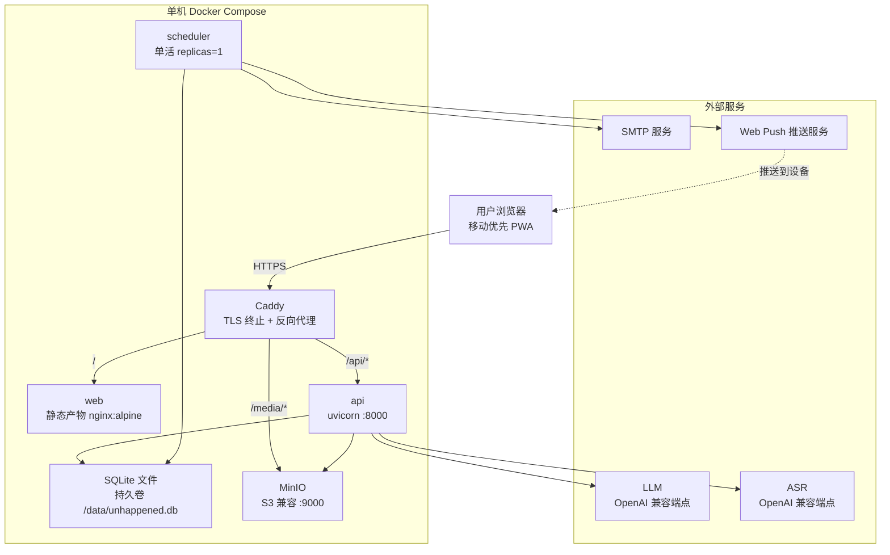

# core-01-deployment-plan

> 最后更新：2026-09-03
> 模块：core｜阶段：Phase 3 Step 3 部署方案与 smoke 策略设计
> 上游：`../1-architecture/core-01-architecture-overview.md` 第八节交接项、
> `../../../api/*.yaml`、`../../../database/schema.sql`
> 本文件只设计方案，**不执行任何部署命令**。

## 一、部署目标

| 项 | 结论 |
|----|------|
| 是否需要部署 | 需要。`deployment_required: true` |
| 是否需要 smoke | 需要。`smoke_required: true` |
| 目标环境 | `local`（开发）、`staging`（验收与 smoke 门禁）、`production`（人类确认后发布） |
| 预发环境 | 不设。团队 1–3 人，staging 同时承担预发职责 |
| 部署形态 | Docker Compose 单机部署，可迁移到任意 VPS 或云主机 |
| 运行单元 | 3 个：`web`（静态产物）、`api`（uvicorn）、`scheduler`（单活） |
| 依赖服务 | S3 兼容对象存储、OpenAI 兼容 LLM 端点、OpenAI 兼容 ASR 端点、SMTP、Web Push（VAPID 无需服务端组件）。**数据库为容器内的一个持久卷文件，不再是独立服务** |
| 域名与证书 | 单域名 + Caddy 自动签发 Let's Encrypt 证书。**PWA 的 Web Push 与 Service Worker 强制 HTTPS**，因此证书是功能依赖而非可选加固 |

不选 Kubernetes、不选 Serverless 的理由：数据库是**卷里的一个 SQLite 文件**，多节点无法共享写入；`scheduler` 也必须单活。Serverless 的无状态短生命周期模型与两者都冲突。而 3 个运行单元、千级用户的规模用 Compose 足够，K8s 的运维成本换不回等价收益。

## 二、部署拓扑



三点拓扑上的取舍：

1. **对象存储走 Caddy 反代而非直连**。预签名 URL 需要与站点同源或配置 CORS；经 Caddy 暴露 `/media/*` 可避免额外域名与证书，也让 MinIO 不必对公网开放。
2. **`scheduler` 与 `api` 共享同一镜像**，只是入口命令不同（`uvicorn` vs `python -m app.scheduler`）。避免两套构建产物版本漂移。
3. **`production` 的对象存储可替换为托管服务**（云 OSS），只需改环境变量；Compose 里的 `minio` 服务在 production profile 中不启用。数据库无托管选项——它就是卷里的一个文件，因此**卷的持久化与备份是部署的第一等公民**（见第五、六节）。

## 三、环境变量与密钥

### 3.1 应用配置（非密钥）

| 变量 | 示例值 | 说明 |
|------|--------|------|
| `APP_ENV` | `local` / `test` / `staging` / `production` | **决定 `/api/test/*` 是否注册路由**。非 `test` 时该模块不导入 |
| `APP_BASE_URL` | `https://unhappened.example.com` | 用于邮件正文中的链接与 CORS 白名单 |
| `LLM_BASE_URL` | `https://<provider>/v1` | OpenAI 兼容端点 |
| `LLM_MODEL` | `<provider-model-id>` | 供应商与模型均由配置决定，代码中不出现厂商名 |
| `LLM_TIMEOUT_SECONDS` | `5` | 与验收条件「≤5 秒」对齐，不可调大 |
| `ASR_BASE_URL` | `https://<provider>/v1` | OpenAI 兼容转写端点 |
| `ASR_MODEL` | `<provider-asr-id>` | — |
| `ASR_TIMEOUT_SECONDS` | `15` | 与非功能性约束「转写 P95 ≤15 秒」对齐 |
| `S3_ENDPOINT` | `http://minio:9000` | production 换为云 OSS 端点 |
| `S3_BUCKET` | `unhappened-media` | — |
| `S3_PUBLIC_BASE` | `https://unhappened.example.com/media` | 预签名 URL 对外的基地址 |
| `REMINDER_WEEKLY_BUDGET` | `3` | 与数据库 CHECK 约束保持一致，改动需同步迁移 |
| `SCHEDULER_INTERVAL_SECONDS` | `300` | 扫描间隔 |
| `SMTP_HOST` / `SMTP_PORT` / `SMTP_FROM` | — | 邮件兜底通道 |
| `VAPID_SUBJECT` | `mailto:ops@example.com` | Web Push 要求的联系方式 |

### 3.2 密钥（不可提交，不可进日志）

| 密钥 | 来源 | 丢失后果 |
|------|------|---------|
| `DATABASE_URL` | `.env`（仅 600 权限） | 指向卷内文件路径；配错会建出一个空库，**不会报错**，因此部署后检查必须验证表数量 |
| `JWT_SECRET` | 同上 | 全部用户被登出，可重建（轮换即强制重新登录） |
| `ENCRYPTION_KEY` | 同上 + **离线冷备** | **所有用户内容永久不可读，不可恢复** |
| `S3_ACCESS_KEY` / `S3_SECRET_KEY` | 同上 | 媒体不可读写，可重建 |
| `LLM_API_KEY` / `ASR_API_KEY` | 同上 | Agent 能力降级（产品仍可用），可重建 |
| `SMTP_PASSWORD` | 同上 | 邮件兜底失效，可重建 |
| `VAPID_PRIVATE_KEY` | 同上 | 已有推送订阅全部失效，需用户重新授权 |

> **`ENCRYPTION_KEY` 是这套部署里唯一不可重建的东西。** 数据库备份、对象存储、代码都可以重来，这把密钥丢了等于所有人的愿望原话永久变成乱码。要求：与数据库文件备份**分开存放**（放在一起等于没加密）、离线冷备至少两份、部署脚本中禁止 `echo`。密钥轮换需要一次全表重写，不在 MVP 范围。

### 3.3 数据库不再有角色（原三角色方案作废）

PostgreSQL 方案里靠 `unhappened_app` / `unhappened_auth` / `unhappened_scheduler` 三个角色配合 RLS 做隔离。**SQLite 没有角色也没有 RLS，这一节整体作废**：三个连接串合并为一个 `DATABASE_URL`，隔离全部落到应用层（架构 5.3 的两道防线）。

随之取消的部署动作：建角色、`GRANT`、`CREATE EXTENSION pgcrypto`。

新增的部署要求：

| 项 | 要求 |
|----|------|
| 卷持久化 | `.db` 文件必须落在命名卷或宿主目录，**不能留在容器可写层**——容器重建即数据全丢 |
| WAL 文件 | `-wal` 与 `-shm` 与主文件同目录，备份时必须一起复制，或先执行 `PRAGMA wal_checkpoint(TRUNCATE)` |
| 并发 | `api` 与 `scheduler` 两个进程共享同一文件，均需 `busy_timeout`；SQLite 单写者，写入串行化 |
| 文件权限 | `.db` 与 `.env` 一律 600，属主为容器内运行用户 |

### 3.4 原「PostgreSQL 必需配置」已取消

原 3.4 节要求强制关闭 `log_statement`，理由是 pgcrypto 在数据库进程内加密、应用发送的是明文参数。**改为应用层 AES-256-GCM 后明文根本不进入 SQL，这条要求随之取消**——这是本次方言变更里唯一让攻击面变小的地方。

取而代之的一条 SQLite 特有要求：

```conf
PRAGMA journal_mode = WAL;      -- 读不阻塞写
PRAGMA busy_timeout = 5000;     -- 避免瞬时 database is locked
PRAGMA foreign_keys = ON;       -- SQLite 默认不开外键
```

这三条由应用在每次建立连接时执行（见 `backend/app/db.py`），不依赖运维手工配置——因为漏配的后果（外键失效导致级联删除不生效）是静默的。

## 四、构建与发布命令

### 4.1 本地开发

```bash
# 起依赖：只需 minio + LLM/ASR mock（数据库是本地文件，无需容器）
docker compose --profile local up -d minio agent-mock

# 后端
cd backend && uv sync && uv run alembic upgrade head
uv run uvicorn app.main:app --reload --port 8000

# 前端
cd frontend && pnpm install && pnpm dev
```

`local` 与 `test` 环境下 `agent-mock` 替代真实 LLM/ASR，因此**本地可以离线跑完全部 ST**。

### 4.2 构建

```bash
# 前端：产出纯静态目录 frontend/dist
cd frontend && pnpm install --frozen-lockfile && pnpm build

# 后端与调度共享同一镜像，入口命令不同
docker build -t unhappened-api:<git-sha> ./backend
```

镜像 tag 一律用 git sha，不用 `latest`——回滚需要一个确定的目标。

### 4.3 发布顺序（staging 与 production 相同）

```bash
# 0. 前置检查：确认迁移向后兼容（见第五节）
cd backend && uv run alembic upgrade head --sql > /tmp/migration.sql  # 人工过一眼

# 1. 数据库迁移（先迁移后切流）
docker compose run --rm api uv run alembic upgrade head

# 2. 发布 api
docker compose up -d --no-deps api

# 3. 发布静态站点
docker compose up -d --no-deps web

# 4. 重启 scheduler（最后，确保它跑的是新代码 + 新 schema）
docker compose up -d --no-deps --force-recreate scheduler

# 5. 部署后检查
bash ops/post-deploy-check.sh   # 见第七节
```

顺序理由：`scheduler` 放最后，因为它是唯一会在无人值守时写数据的进程——先让 `api` 在新 schema 上跑通、确认无误，再放它进来。

## 五、数据迁移策略

| 项 | 规则 |
|----|------|
| 工具 | Alembic，`backend/migrations/` |
| 初始迁移 | 由 `logos/resources/database/schema.sql` 转写为首个 revision，**不在生产直接执行 schema.sql** |
| 方言限制 | SQLite 的 `ALTER TABLE` 只支持加列与改表名。**改列 / 加约束 / 改类型一律用 `op.batch_alter_table()`**，Alembic 会自动走「建新表 → 拷数据 → 换名」；该过程会短暂持有写锁 |
| 迁移时机 | 先迁移，后切流（应用镜像发布之前） |
| 兼容要求 | 每个 revision 必须能被**旧版应用代码**安全运行（加列可空、加索引、加表） |
| 破坏性变更 | 删列、改类型、加 NOT NULL 一律走两阶段：先发一版只写不读的兼容代码，下个版本再收窄。禁止在一次发布里同时改 schema 与读写方式 |
| 初始化数据 | 无种子业务数据。仅 `scheduler_heartbeat` 插入固定单行（`id=1`） |
| 角色与扩展 | 不再需要（SQLite 无角色、加密在应用层） |
| 迁移前备份 | **每次迁移前先复制一份 `.db` 文件**。SQLite 的 batch_alter_table 是重建表，失败时回滚依赖文件副本而非事务 |
| 迁移耗时 | 千级用户下所有迁移预期 <1 秒。SQLite **不支持 `CREATE INDEX CONCURRENTLY`**，建索引会持有写锁，因此大表加索引须安排在低峰期 |

## 五·增补：本次变更（preferences-availability-timing）的迁移说明

| 项 | 内容 |
|----|------|
| 新增表 | `user_preferences`、`availability_windows`、`timing_proposals`——三张全新表，**不改动既有表的任何列**，属第五节「兼容要求」中最安全的加表类迁移 |
| 迁移形态 | 单个 Alembic revision 内三条 `CREATE TABLE` + 索引；SQLite 原生支持建表，无需 `batch_alter_table`，不触发重建表锁 |
| 数据回填 | 无。三张表从空表起步，无种子数据、无历史数据迁移 |
| 向后兼容 | 旧版应用代码不读不写这三张表，迁移后旧版本继续正常运行；`scheduler` 低频任务（提议过期、摘要生成）在新代码中才注册 |
| 迁移前备份 | 沿用第五节既有要求：先复制 `.db` 文件；本次迁移虽为加表，仍执行不豁免 |
| 回滚 | 应用回滚沿用上一镜像即可（旧代码不感知新表）；数据库回滚可恢复备份，也可保留新表不回滚——三张空表对旧代码无影响。`alembic downgrade -1` 可安全删除三表 |
| 表数量联动 | 部署后检查与 smoke 的表数量断言由 17 张更新为 **20 张**（索引数量以迁移产物实际为准，由「表数量与迁移版本相符」的相对断言覆盖） |
| 新增配置 | 无新增环境变量。提议有效期（7 天）与摘要周期（每日）先以服务常量落地，待需求 5.4 第 5/6 条确认后再提升为配置 |

## 五·增补：本次变更（holiday-aware-timing）的部署说明

| 项 | 内容 |
|----|------|
| 新增表 | 无。本提案不含数据库迁移（节假日数据是随镜像发布的文件，不是表） |
| 数据文件 | `backend/app/data/holidays_{year}.json` 打进 api/scheduler 共享镜像；文件只读，无运行时写入 |
| 兼容性 | 应用回滚指回上一镜像即可；旧镜像无新计算逻辑，退化为「不考虑节假日」的现状语义（安全降级）。新镜像在缺年份文件时同样退化——双向安全 |
| 运维新增项 | **年度数据更新**：每年官方节假日公告发布后（通常 11–12 月）新增次年 `holidays_{year}.json` 并随一次版本发布上线；更新即发版，不做在线热更新。发布前后的过渡期按缺年份降级运行 |
| 验证要点 | 部署后检查无需新增项；free_weekend 计算正确性属 ST 职责（部署方案 8.1 既有约定：smoke 不验证时机计算正确性，只验证能触发一轮扫描） |
| smoke | 复用既有 20 项，无新增 ID；SMOKE-core-11（约定一个时机）的断言不依赖节假日语义，行为兼容 |

## 六、回滚策略

| 层 | 策略 |
|----|------|
| 应用 | `docker compose up -d` 指回上一个 git sha 镜像。3 个单元可独立回滚 |
| 数据库 | 首选**直接恢复迁移前的 `.db` 文件副本**——单文件数据库的回滚就是一次文件替换，比 `alembic downgrade` 更可靠。`downgrade -1` 仅在确认该 revision 为向后兼容变更时使用 |
| 对象存储 | 不回滚。媒体只增不改，回滚应用不影响已上传对象 |
| 提醒队列 | 回滚前先停 `scheduler`，避免旧代码消费新格式的 `reminder_outbox` 记录 |
| 判定回滚的信号 | smoke 失败、`/api/v1/health` 非 200、LLM 降级率突增（说明配置错了而非供应商故障）、`reminder_outbox` 中 `failed` 比例 >5% |
| 不可回滚项 | 用户已彻底删除的愿望（设计上无撤销）；已发出的提醒 |

回滚演练要求：staging 每次发布后执行一次 `downgrade -1` 再 `upgrade head`，确认迁移双向可用。这个动作比写在文档里的承诺可靠。

## 七、部署后检查清单

`ops/post-deploy-check.sh` 逐项执行，任一失败即判定发布失败：

| # | 检查项 | 判定标准 |
|---|--------|---------|
| 1 | 健康检查 | `GET /api/v1/health` 返回 200 且 `database=ok` |
| 2 | 调度存活 | `health` 的 `scheduler_heartbeat_age_seconds` < 900 |
| 3 | 迁移版本 | `alembic current` 等于本次发布的目标 revision |
| 4 | 静态资源 | `GET /` 返回 200；`GET /manifest.webmanifest` 与 Service Worker 均可取 |
| 5 | HTTPS 与证书 | 证书有效期 >14 天；HTTP 自动 301 到 HTTPS |
| 6 | 测试后门已关闭 | `GET /api/test/outbox` 在 staging / production 返回 404 |
| 7 | 数据隔离守卫 | 用第二个账号的 token 访问第一个账号的愿望返回 404；`owner_guard` 在启动日志中确认已安装 |
| 8 | 数据库文件与 PRAGMA | `.db` 文件在持久卷内且权限 600；`PRAGMA foreign_keys` 为 1、`journal_mode` 为 wal；表数量与迁移版本相符 |
| 9 | 对象存储可写 | 签发一个预签名 URL 并完成一次 PUT + HEAD |
| 10 | 外部依赖可达 | LLM / ASR 端点连通性探测（失败仅告警，不阻断发布——产品设计允许降级运行） |
| 11 | 密钥已注入 | 所有必需环境变量非空；`ENCRYPTION_KEY` 长度符合预期（不打印值） |
| 12 | 日志无明文 | 抽查最近 100 条应用日志，不含愿望原话字段（加密在应用层，数据库侧已无明文泄露路径） |

第 6 项和第 12 项是这个产品特有的：一个主打私密的应用，把测试后门或明文日志带上生产，比功能故障更严重。

## 八、冒烟测试方案

### 8.1 smoke 的执行前提

| 项 | 约定 |
|----|------|
| 执行环境 | `staging` 与 `production`（production 需人类确认后执行） |
| 数据 | smoke 自建一个匿名账号并在结束时**彻底删除**，不留残留数据 |
| 外部依赖 | LLM / ASR **不 mock**——但**降级路径也算通过**。理由见 8.3 |
| 时钟 | 不注入。`/api/test/clock` 在非 test 环境不存在，smoke 只验证「能触发一轮扫描」，不验证「时机计算正确」（那是 ST 的职责） |
| 幂等 | smoke 可重复执行，不依赖前次残留 |

### 8.2 必须覆盖的检查项（供 `test-writer` 生成 `SMOKE-*` 用例）

| 类别 | 检查项 | 对应场景 / 端点 |
|------|--------|----------------|
| 健康检查 | 服务与数据库连通、调度心跳新鲜 | `GET /api/v1/health` |
| 配置与密钥 | 必需环境变量齐备；`APP_ENV` 正确；测试后门 404 | 第七节 6 / 11 |
| 数据库迁移 | `alembic current` 命中目标 revision；20 张表（原 17 张 + preferences-availability-timing 新增 3 张）与索引齐备 | 第五节 |
| 静态资源 | 首页、`manifest.webmanifest`、Service Worker 可取 | S05.1 的 `/garden` 入口 |
| 核心入口 | 匿名建号 → 拿到 access token | S01 Step 3，`POST /auth/anonymous` |
| 关键链路 | 种下一个愿望（文字）→ 出现在花园 | S02，`POST /wishes` + `GET /wishes` |
| 关键链路 | 约定一个时机 → 卡面出现时机文案 | S03，`PUT /wishes/{id}/timing` |
| 关键链路 | 手动触发一轮调度 → 提醒进入 outbox | 架构第八节；staging 用 `POST /api/test/scheduler/tick`，production 用 `docker compose run --rm scheduler --once` |
| 关键链路 | 标记已发生 → 生成记忆页 → 收进书里 → 出现在书架 | S06 全链路 |
| 关键链路（S08 增补） | 声明一条偏好 → 能读回且来源为 declared；保存一条可用时段 → 能读回 | S08，`PUT /me/preferences` + `GET /me/preferences`、`POST /me/availability` + `GET /me/availability`；断言写响应不回显 value 明文 |
| 数据隔离 | 新建第二个匿名账号，用其 token 访问第一个账号的愿望与偏好，必须 404 | S05 EX-3.1 + S08 EX-19.1 |
| 加密落地 | 直接查库确认 `wishes.title_enc` 与 `user_preferences.value_enc` 不是可读明文 | `schema.sql` 加密约定 |
| 清理 | 彻底删除 smoke 账号的愿望 → 媒体对象与记录均不存在；删除偏好与时段 → 无残留 | S05.2 Step 25–31 + S08 Step 17–20 |
| 日志与监控 | 上述请求产生的日志含 `request_id`，且不含愿望原话 | 第七节 12 |

### 8.3 smoke 与外部依赖的关系（一个刻意的决定）

**LLM / ASR 在 smoke 中不 mock，且它们失败不导致 smoke 失败。**

理由：产品的核心承诺是「Agent 不可用也不能丢掉用户说的话」。如果 smoke 因为 LLM 超时就判定发布失败，等于把一个供应商的可用性变成自己的发布门禁；反过来，如果 smoke 只跑 mock，就永远验证不了真实端点的配置是否正确。

因此 smoke 对这两个依赖的断言是分层的：

- **必须通过**：`POST /wishes` 返回 201 且愿望出现在花园——无论 `degraded` 是 true 还是 false。
- **仅告警**：`degraded == true`。此时 smoke 结果为 PASS，但报告中标注「Agent 降级」，提示运维检查 `LLM_BASE_URL` / `LLM_API_KEY` 是否配错。
- **必须通过**：降级时 `wish.title` 非空（回退为原话前 20 字）且 `original_text` 与提交内容一致——这正是降级承诺本身。

具体 `SMOKE-*` 用例由 `test-writer` 在 Phase 3 Step 4a 输出到 `logos/resources/test/smoke/`。

## 九、门禁结论

| 门禁 | 结论 |
|------|------|
| `deployment_required` | `true` |
| `smoke_required` | `true` |
| 环境 | `staging`（必过）、`production`（人类确认后执行并复跑 smoke） |
| 部署执行前置 | 1）代码实现完成；2）`openlogos verify` 通过；3）用户明确授权 |
| smoke 失败处理 | 立即按第六节回滚，不允许「先上线再修」 |
| 本 Skill 的边界 | 只设计方案。部署执行由 `deployment-executor` 在人类确认后进行 |

### 待确认事项

1. **对象存储托管方式**：production 用自托管 MinIO 还是云 OSS？影响 3.2 的密钥来源。数据库已无此问题——它是卷里的文件。
2. **备份策略未定（SQLite 下更关键）**：建议每日 `sqlite3 unhappened.db ".backup /backup/$(date +%F).db"`（在线安全备份，不要直接 `cp` 未 checkpoint 的库）+ 保留 14 天，对象存储开版本化。备份文件与 `ENCRYPTION_KEY` 必须分开存放——放在一起等于没加密。
3. **域名与邮件发件域**：邮件兜底通道需要配置 SPF / DKIM，否则提醒会进垃圾箱，等于 iOS 用户收不到任何提醒。
4. **监控告警落地方式**：架构第六节定义了 4 条告警（LLM 降级率、投递失败率、周预算顺延量、调度心跳），但用什么承载（Prometheus / 云监控 / 简单的定时脚本 + 邮件）未定。


